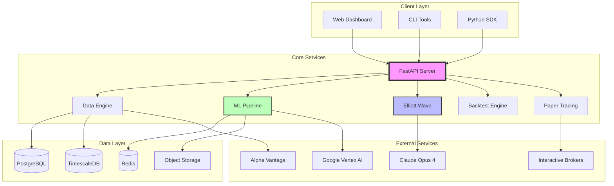

# Architecture Components

FXML4 is built with a modular, microservices-inspired architecture that allows for scalability, maintainability, and flexibility.

## System Overview



## Core Components

### 1. API Server (FastAPI)

The central hub for all client interactions:

```python
# fxml4/api/main.py
from fastapi import FastAPI, Depends
from fastapi.middleware.cors import CORSMiddleware
from fxml4.api.routers import data, signals, backtest, elliott_wave

app = FastAPI(
    title="FXML4 Trading Platform",
    version="1.0.0",
    description="Integrated forex trading with ML and Elliott Wave analysis"
)

# Middleware
app.add_middleware(
    CORSMiddleware,
    allow_origins=["*"],
    allow_methods=["*"],
    allow_headers=["*"],
)

# Routers
app.include_router(data.router, prefix="/data", tags=["market-data"])
app.include_router(signals.router, prefix="/signals", tags=["signals"])
app.include_router(backtest.router, prefix="/backtest", tags=["backtesting"])
app.include_router(elliott_wave.router, prefix="/elliott-wave", tags=["elliott-wave"])
```

**Key Features:**
- RESTful API design
- WebSocket support for real-time data
- JWT authentication
- Rate limiting
- OpenAPI documentation
- Async request handling

### 2. Data Engine

Manages all data acquisition, processing, and storage:

```python
# fxml4/data_engineering/data_engine.py
class DataEngine:
    """Central data management system."""

    def __init__(self):
        self.db_manager = DatabaseManager()
        self.data_fetcher = DataFetcher()
        self.data_processor = DataProcessor()
        self.cache_manager = CacheManager()

    async def get_market_data(
        self,
        symbol: str,
        timeframe: str,
        start_date: datetime,
        end_date: datetime
    ) -> pd.DataFrame:
        """Retrieve market data with caching."""

        # Check cache first
        cache_key = f"{symbol}:{timeframe}:{start_date}:{end_date}"
        cached_data = await self.cache_manager.get(cache_key)
        if cached_data:
            return cached_data

        # Check database
        db_data = await self.db_manager.get_data(
            symbol, timeframe, start_date, end_date
        )

        if db_data.empty:
            # Fetch from external source
            fresh_data = await self.data_fetcher.fetch(
                symbol, timeframe, start_date, end_date
            )

            # Process and store
            processed_data = self.data_processor.process(fresh_data)
            await self.db_manager.store_data(processed_data)
            db_data = processed_data

        # Cache for future use
        await self.cache_manager.set(cache_key, db_data, ttl=300)

        return db_data
```

**Components:**
- **Data Fetcher**: Interfaces with external data providers
- **Data Processor**: Cleans and normalizes data
- **Database Manager**: Handles PostgreSQL/TimescaleDB operations
- **Cache Manager**: Redis-based caching layer

### 3. ML Pipeline

End-to-end machine learning workflow:

```python
# fxml4/ml/pipeline.py
class MLPipeline:
    """Complete ML pipeline for signal generation."""

    def __init__(self, config: MLConfig):
        self.feature_engineer = FeatureEngineer()
        self.model_trainer = ModelTrainer()
        self.signal_generator = SignalGenerator()
        self.model_registry = ModelRegistry()

    def train_model(self, training_data: pd.DataFrame) -> Model:
        """Train new model with walk-forward optimization."""

        # Feature engineering
        features = self.feature_engineer.create_features(training_data)

        # Split data
        train, val, test = self.split_data(features)

        # Train model
        model = self.model_trainer.train(
            train_data=train,
            val_data=val,
            hyperparameters=self.config.hyperparameters
        )

        # Evaluate
        metrics = self.evaluate_model(model, test)

        # Register if performance acceptable
        if metrics['sharpe_ratio'] > self.config.min_sharpe:
            self.model_registry.register(model, metrics)

        return model
```

**Sub-components:**
- **Feature Engineer**: Creates 100+ technical indicators
- **Model Trainer**: Supports multiple algorithms (XGBoost, LSTM, etc.)
- **Signal Generator**: Converts predictions to trading signals
- **Model Registry**: Version control for models

### 4. Elliott Wave System

The innovative visual analysis system:

```python
# fxml4/wave_analysis/elliott_wave_system.py
class ElliottWaveSystem:
    """Complete Elliott Wave analysis system."""

    def __init__(self):
        self.algorithmic_analyzer = AlgorithmicAnalyzer()
        self.chart_generator = ChartGenerator()
        self.visual_analyzer = VisualAnalyzer()
        self.decision_synthesizer = DecisionSynthesizer()

    async def analyze(
        self,
        price_data: pd.DataFrame,
        symbol: str
    ) -> ElliottWaveAnalysis:
        """Run complete Elliott Wave analysis."""

        # Parallel processing
        algo_task = asyncio.create_task(
            self.algorithmic_analyzer.analyze(price_data)
        )
        chart_task = asyncio.create_task(
            self.chart_generator.generate(price_data)
        )

        # Get algorithmic results
        algo_result = await algo_task

        # Decide if visual needed
        if self.should_use_visual(algo_result):
            chart = await chart_task
            visual_result = await self.visual_analyzer.analyze(
                chart, algo_result
            )

            # Combine results
            final_analysis = self.decision_synthesizer.synthesize(
                algo_result, visual_result
            )
        else:
            final_analysis = algo_result

        return final_analysis
```

**Key Components:**
- **Algorithmic Analyzer**: Mathematical pattern detection
- **Chart Generator**: Creates annotated technical charts
- **Visual Analyzer**: Claude Opus 4 integration
- **Decision Synthesizer**: Combines all inputs

### 5. Backtesting Engine

Event-driven backtesting with realistic simulation:

```python
# fxml4/backtesting/event_engine.py
class EventDrivenBacktester:
    """Realistic event-driven backtesting engine."""

    def __init__(self, config: BacktestConfig):
        self.event_queue = Queue()
        self.data_handler = DataHandler()
        self.strategy = config.strategy
        self.portfolio = Portfolio(config.initial_capital)
        self.execution_handler = ExecutionHandler()
        self.performance_tracker = PerformanceTracker()

    def run_backtest(self) -> BacktestResults:
        """Execute backtest simulation."""

        # Initialize
        self.data_handler.initialize()

        # Main event loop
        while True:
            try:
                event = self.event_queue.get(timeout=1)
            except Empty:
                if self.data_handler.continue_backtest:
                    self.data_handler.update_bars()
                else:
                    break

            if isinstance(event, MarketEvent):
                self.strategy.calculate_signals(event)
                self.portfolio.update_timeindex(event)

            elif isinstance(event, SignalEvent):
                self.portfolio.update_signal(event)

            elif isinstance(event, OrderEvent):
                self.execution_handler.execute_order(event)

            elif isinstance(event, FillEvent):
                self.portfolio.update_fill(event)
                self.performance_tracker.record_trade(event)

        # Calculate final metrics
        return self.performance_tracker.calculate_metrics()
```

**Features:**
- **Event Queue**: Simulates real market events
- **Realistic Execution**: Slippage and transaction costs
- **Portfolio Management**: Multi-asset support
- **Performance Tracking**: Comprehensive metrics

### 6. Paper Trading Engine

Live market simulation with IB integration:

```python
# fxml4/trading/paper_trading_engine.py
class PaperTradingEngine:
    """Real-time paper trading with Interactive Brokers."""

    def __init__(self, config: TradingConfig):
        self.ib_client = IBClient()
        self.position_manager = PositionManager()
        self.risk_manager = RiskManager()
        self.order_manager = OrderManager()
        self.performance_monitor = PerformanceMonitor()

    async def start_trading(self):
        """Start paper trading session."""

        # Connect to IB
        await self.ib_client.connect()

        # Subscribe to market data
        for symbol in self.config.symbols:
            await self.ib_client.subscribe_market_data(symbol)

        # Start trading loop
        while self.is_trading_hours():
            # Get signals
            signals = await self.get_trading_signals()

            # Risk checks
            validated_signals = self.risk_manager.validate_signals(
                signals,
                self.position_manager.get_positions()
            )

            # Execute trades
            for signal in validated_signals:
                order = self.create_order(signal)
                await self.order_manager.submit_order(order)

            # Monitor performance
            self.performance_monitor.update()

            await asyncio.sleep(self.config.update_interval)
```

## Data Layer

### PostgreSQL
- **Purpose**: Primary data storage
- **Tables**: Users, symbols, trades, signals, backtests
- **Optimizations**: Indexed queries, partitioning

### TimescaleDB
- **Purpose**: Time-series data optimization
- **Features**: Hypertables, continuous aggregates, compression
- **Use cases**: Market data, performance metrics

### Redis Cache
- **Purpose**: High-speed data access
- **TTL**: 5 minutes for market data, 1 hour for analysis
- **Patterns**: Cache-aside, write-through

### Object Storage (S3/GCS)
- **Purpose**: Model storage, chart images, reports
- **Structure**: Organized by date and type
- **Lifecycle**: 90-day retention for non-critical

## External Integrations

### Interactive Brokers
```python
class IBConnector:
    """Interactive Brokers TWS/Gateway connector."""

    async def connect(self):
        self.client = await ib_insync.IB().connectAsync(
            host=self.config.host,
            port=self.config.port,
            clientId=self.config.client_id
        )

    async def get_market_data(self, symbol: str) -> MarketData:
        contract = Stock(symbol, 'SMART', 'USD')
        ticker = self.client.reqMktData(contract)
        await asyncio.sleep(2)  # Wait for data
        return self.parse_ticker(ticker)
```

### Alpha Vantage
```python
class AlphaVantageClient:
    """Alpha Vantage data provider."""

    async def fetch_forex_data(
        self,
        from_symbol: str,
        to_symbol: str,
        interval: str
    ) -> pd.DataFrame:
        url = self.build_url(from_symbol, to_symbol, interval)
        async with aiohttp.ClientSession() as session:
            async with session.get(url) as response:
                data = await response.json()
                return self.parse_response(data)
```

### Claude Opus 4
```python
class ClaudeAnalyzer:
    """Claude Opus 4 integration for visual analysis."""

    async def analyze_chart(
        self,
        chart_base64: str,
        prompt: str
    ) -> Dict:
        response = await self.anthropic_client.messages.create(
            model="claude-opus-4-20250514",
            messages=[{
                "role": "user",
                "content": [
                    {"type": "image", "source": {"type": "base64", "data": chart_base64}},
                    {"type": "text", "text": prompt}
                ]
            }],
            max_tokens=1000,
            temperature=0.2
        )
        return self.parse_response(response)
```

### Google Vertex AI
```python
class VertexAITrainer:
    """Google Vertex AI for distributed training."""

    async def train_model(
        self,
        training_data_path: str,
        model_config: Dict
    ) -> str:
        job = aiplatform.CustomTrainingJob(
            display_name="fxml4-model-training",
            script_path="training/train.py",
            container_uri="gcr.io/vertex-ai/training/tf-cpu.2-8:latest",
            requirements=["pandas", "numpy", "xgboost"],
            model_serving_container_image_uri="gcr.io/vertex-ai/prediction/tf2-cpu.2-8:latest"
        )

        model = job.run(
            dataset=training_data_path,
            model_display_name="fxml4-model",
            args=model_config
        )

        return model.resource_name
```

## Communication Patterns

### Synchronous Communication
- REST API calls between services
- Database queries
- Cache lookups

### Asynchronous Communication
- WebSocket for real-time data
- Event-driven backtesting
- Background job processing

### Message Queue (Future)
```python
# Planned implementation
class MessageQueue:
    """RabbitMQ/Kafka for service decoupling."""

    async def publish(self, topic: str, message: Dict):
        await self.producer.send(topic, message)

    async def subscribe(self, topic: str, handler: Callable):
        await self.consumer.subscribe(topic)
        async for message in self.consumer:
            await handler(message)
```

## Security Architecture

### Authentication
- JWT tokens with refresh mechanism
- API key management for external services
- Role-based access control (RBAC)

### Data Security
- Encryption at rest (database)
- Encryption in transit (TLS)
- Sensitive data masking in logs

### Network Security
- VPC isolation in cloud deployments
- Firewall rules for service communication
- DDoS protection at API gateway

## Scalability Considerations

### Horizontal Scaling
- Stateless API servers
- Read replicas for database
- Distributed cache cluster
- Load balancer configuration

### Vertical Scaling
- Resource monitoring
- Auto-scaling policies
- Performance profiling
- Query optimization

### Future Microservices Architecture
```yaml
# Planned service decomposition
services:
  - name: data-service
    responsibility: Market data management

  - name: ml-service
    responsibility: Model training and inference

  - name: elliott-wave-service
    responsibility: Wave analysis

  - name: trading-service
    responsibility: Order execution

  - name: risk-service
    responsibility: Risk management
```

## Monitoring and Observability

### Metrics
- Prometheus for metrics collection
- Grafana for visualization
- Custom business metrics

### Logging
- Structured logging (JSON)
- Centralized log aggregation
- Log levels and filtering

### Tracing
- Distributed tracing with OpenTelemetry
- Request flow visualization
- Performance bottleneck identification

## Development Workflow

### Local Development
```bash
# Docker Compose for local services
docker-compose up -d postgres redis

# Run API server with hot reload
uvicorn fxml4.api.main:app --reload

# Run tests
pytest tests/ -v
```

### CI/CD Pipeline
```yaml
# GitHub Actions workflow
name: FXML4 CI/CD
on: [push, pull_request]

jobs:
  test:
    runs-on: ubuntu-latest
    steps:
      - uses: actions/checkout@v2
      - name: Run tests
        run: |
          pip install -r requirements.txt
          pytest tests/

  deploy:
    needs: test
    if: github.ref == 'refs/heads/main'
    steps:
      - name: Deploy to production
        run: |
          kubectl apply -f k8s/
```

## Conclusion

FXML4's architecture is designed for:
- **Modularity**: Easy to extend and maintain
- **Scalability**: Handles growth in users and data
- **Reliability**: Fault-tolerant design
- **Performance**: Optimized for low latency
- **Flexibility**: Adaptable to changing requirements

Each component is carefully crafted to work independently while seamlessly integrating into the larger system, providing a robust platform for algorithmic forex trading.
