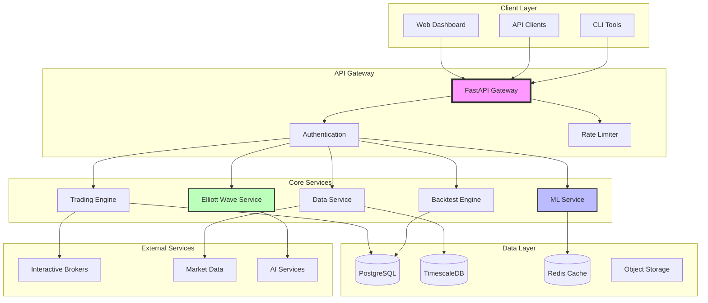
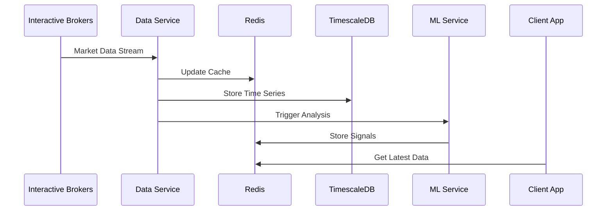
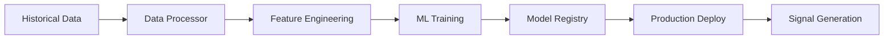
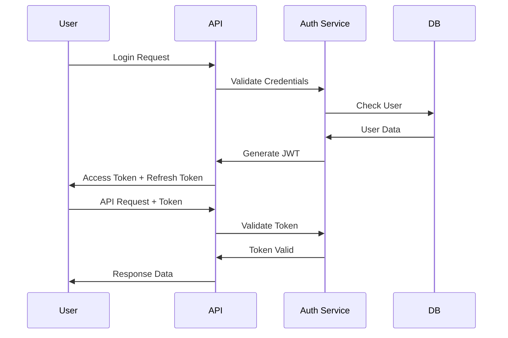

# Architecture Overview

FXML4 is designed as a modern, scalable forex trading platform that combines traditional technical analysis with cutting-edge AI technology. This section provides a comprehensive overview of the system architecture.

## Design Principles

<div class="grid cards" markdown>

-   :material-puzzle:{ .lg .middle } **Modularity**

    ---

    Components are loosely coupled and independently deployable

    [:octicons-arrow-right-24: Components](components.md)

-   :material-scale-balance:{ .lg .middle } **Scalability**

    ---

    Horizontal and vertical scaling capabilities built-in

    [:octicons-arrow-right-24: Scaling strategies](../deployment/scaling.md)

-   :material-shield-check:{ .lg .middle } **Reliability**

    ---

    Fault-tolerant design with graceful degradation

    [:octicons-arrow-right-24: System overview](../architecture.md)

-   :material-speedometer:{ .lg .middle } **Performance**

    ---

    Optimized for low-latency trading operations

    [:octicons-arrow-right-24: Data flow](data-flow.md)

</div>

## High-Level Architecture



## System Layers

### 1. Client Layer
- **Web Dashboard**: React-based trading interface
- **API Clients**: Python SDK, REST clients
- **CLI Tools**: Command-line utilities for automation

### 2. API Gateway
- **FastAPI Server**: High-performance async API
- **Authentication**: JWT-based auth with refresh tokens
- **Rate Limiting**: Protection against abuse
- **Load Balancing**: Distribution across service instances

### 3. Core Services
- **Trading Engine**: Order management and execution
- **ML Service**: Model training and inference
- **Elliott Wave Service**: Pattern recognition and analysis
- **Data Service**: Market data management
- **Backtest Engine**: Strategy simulation

### 4. Data Layer
- **PostgreSQL**: Transactional data and metadata
- **TimescaleDB**: Time-series market data
- **Redis**: Caching and session management
- **Object Storage**: Models, charts, and reports

### 5. External Services
- **Interactive Brokers**: Live trading and data
- **Market Data Providers**: Alpha Vantage, etc.
- **AI Services**: Claude Opus 4, Vertex AI

## Key Architectural Patterns

### Microservices Architecture
```yaml
services:
  api-gateway:
    responsibility: Request routing, auth, rate limiting
    technology: FastAPI, nginx

  trading-service:
    responsibility: Order execution, position management
    technology: Python, ib_insync

  ml-service:
    responsibility: Model training, signal generation
    technology: Python, XGBoost, TensorFlow

  elliott-wave-service:
    responsibility: Pattern detection, visual analysis
    technology: Python, Claude API

  data-service:
    responsibility: Data ingestion, processing
    technology: Python, pandas, TimescaleDB
```

### Event-Driven Architecture
```python
# Event bus for service communication
class EventBus:
    def publish(self, event_type: str, data: dict):
        """Publish event to subscribers"""

    def subscribe(self, event_type: str, handler: Callable):
        """Subscribe to event type"""

# Example events
EVENTS = {
    "SIGNAL_GENERATED": "New trading signal created",
    "ORDER_FILLED": "Order execution completed",
    "PATTERN_DETECTED": "Elliott Wave pattern found",
    "MODEL_TRAINED": "New ML model available"
}
```

### Repository Pattern
```python
# Data access abstraction
class MarketDataRepository:
    def __init__(self, db_connection):
        self.db = db_connection

    async def get_candles(
        self,
        symbol: str,
        timeframe: str,
        start: datetime,
        end: datetime
    ) -> pd.DataFrame:
        """Retrieve market data"""

    async def save_candles(
        self,
        data: pd.DataFrame
    ) -> bool:
        """Store market data"""
```

## Data Flow Architecture

### Real-Time Data Flow


### Batch Processing Flow


## Security Architecture

### Defense in Depth
1. **Network Security**
   - VPC isolation
   - Security groups
   - TLS encryption

2. **Application Security**
   - JWT authentication
   - API key management
   - Input validation

3. **Data Security**
   - Encryption at rest
   - Encryption in transit
   - PII protection

### Authentication Flow


## Deployment Architecture

### Container Architecture
```yaml
# Docker Compose for local development
version: '3.8'
services:
  api:
    build: ./api
    ports: ["8000:8000"]
    depends_on: [postgres, redis]

  postgres:
    image: postgres:14
    volumes: ["pgdata:/var/lib/postgresql/data"]

  timescaledb:
    image: timescale/timescaledb:2.9.1-pg14
    volumes: ["tsdata:/var/lib/postgresql/data"]

  redis:
    image: redis:7-alpine
    volumes: ["redis:/data"]
```

### Kubernetes Architecture
```yaml
# Production deployment
apiVersion: apps/v1
kind: Deployment
metadata:
  name: fxml4-api
spec:
  replicas: 3
  selector:
    matchLabels:
      app: fxml4-api
  template:
    spec:
      containers:
      - name: api
        image: fxml4/api:latest
        resources:
          requests:
            memory: "512Mi"
            cpu: "500m"
          limits:
            memory: "1Gi"
            cpu: "1000m"
```

## Performance Architecture

### Caching Strategy
1. **L1 Cache**: Application memory (LRU)
2. **L2 Cache**: Redis distributed cache
3. **L3 Cache**: Database query cache

### Optimization Techniques
- Connection pooling
- Query optimization
- Lazy loading
- Batch processing
- Async I/O

### Performance Targets
| Component | Target Latency | Throughput |
|-----------|---------------|------------|
| API Gateway | < 10ms | 10K req/s |
| ML Inference | < 50ms | 1K req/s |
| Elliott Wave | < 30s | 100 req/min |
| Data Query | < 100ms | 5K req/s |

## Monitoring Architecture

### Observability Stack
```yaml
monitoring:
  metrics:
    collector: Prometheus
    visualization: Grafana

  logging:
    aggregator: Loki
    viewer: Grafana

  tracing:
    collector: Jaeger
    protocol: OpenTelemetry

  alerting:
    manager: AlertManager
    channels: [email, slack, pagerduty]
```

### Key Metrics
- **Business Metrics**: Trades/day, profit/loss, win rate
- **Technical Metrics**: Latency, throughput, error rate
- **Infrastructure Metrics**: CPU, memory, disk, network

## Disaster Recovery

### Backup Strategy
- **Database**: Daily snapshots, point-in-time recovery
- **Models**: Version control in S3/GCS
- **Configuration**: GitOps with version control

### High Availability
- Multi-AZ deployment
- Database replication
- Service redundancy
- Automated failover

## Future Architecture

### Planned Enhancements
1. **Event Streaming**: Kafka for real-time events
2. **Service Mesh**: Istio for microservices
3. **Edge Computing**: Regional deployments
4. **ML Platform**: Kubeflow for ML workflows

### Scalability Roadmap
- Horizontal pod autoscaling
- Database sharding
- CDN for static assets
- Multi-region deployment

## Best Practices

### Development
- 12-factor app principles
- Infrastructure as code
- Continuous integration
- Feature flags

### Operations
- Blue-green deployments
- Canary releases
- Chaos engineering
- Runbooks

### Security
- Zero-trust architecture
- Least privilege access
- Regular security audits
- Dependency scanning

## Conclusion

FXML4's architecture is designed to be:
- **Scalable**: Handle growth in users and data volume
- **Reliable**: Maintain uptime and data integrity
- **Performant**: Low-latency for trading operations
- **Maintainable**: Easy to understand and modify
- **Secure**: Protect user data and trading strategies

For detailed information on specific components, explore the subsections in this architecture guide.
