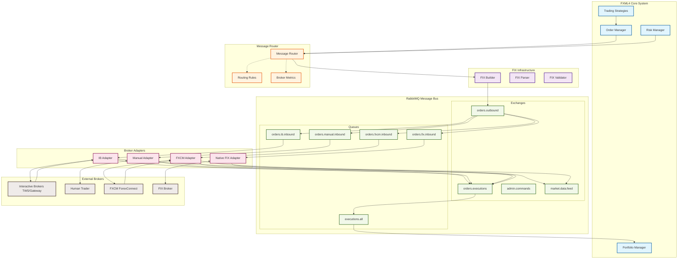
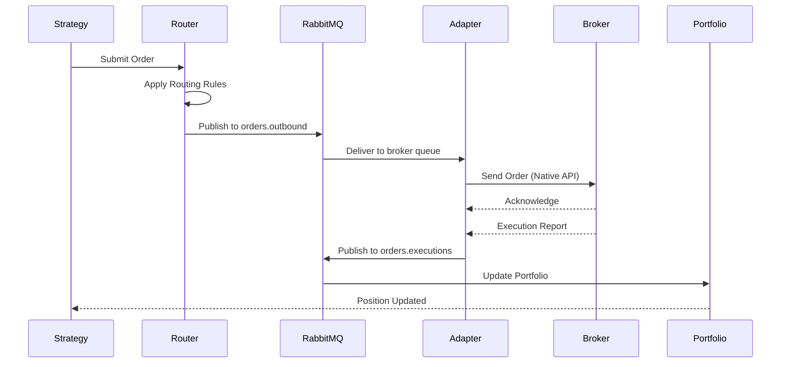

# Broker Abstraction Architecture

## System Architecture Diagram



## Message Flow Sequence



## Component Responsibilities

### Message Router
- **Routing Decision**: Selects optimal broker based on rules and metrics
- **Load Balancing**: Distributes orders across available brokers
- **Failover**: Routes to backup brokers when primary unavailable
- **Monitoring**: Tracks broker performance and availability

### RabbitMQ Topology
- **Order Distribution**: Topic exchange routes by broker type
- **Execution Aggregation**: Collects reports from all brokers
- **Dead Letter Handling**: Failed messages go to DLQ
- **Priority Queues**: Urgent orders get expedited processing

### Broker Adapters
- **Protocol Translation**: Convert between FIX and native broker API
- **Connection Management**: Handle reconnects and heartbeats
- **State Tracking**: Maintain order lifecycle status
- **Error Recovery**: Implement retry logic and failover

## Key Design Decisions

1. **FIX as Internal Protocol**
   - Industry standard for financial messaging
   - Well-defined message types and workflows
   - Enables future direct FIX connections

2. **RabbitMQ for Decoupling**
   - Reliable message delivery with persistence
   - Flexible routing with topic exchanges
   - Built-in dead letter handling
   - Horizontal scalability

3. **Adapter Pattern**
   - Isolates broker-specific logic
   - Enables independent scaling
   - Simplifies testing with mock adapters
   - Supports diverse broker types

4. **Non-HFT Optimization**
   - Focus on reliability over microsecond latency
   - Human-readable message formats
   - Comprehensive logging and auditing
   - Graceful error handling

## Routing Strategies

### 1. Best Execution (Default)
```python
score = latency_weight * (1/latency_ms) +
        fill_rate_weight * fill_rate_pct +
        commission_weight * (1 - commission_rate) +
        load_weight * (1 - current_load)
```

### 2. Symbol Affinity
- FX pairs → FXCM (preferred) → IB (fallback)
- Equities → IB (preferred) → Manual (fallback)
- Large orders → Manual review

### 3. Load Balancing
- Round-robin across available brokers
- Least-loaded broker selection
- Daily volume limits per broker

### 4. Risk-Based Routing
- High-risk orders → Manual approval
- After-hours → Brokers with extended hours
- New strategies → Paper trading first

## Failure Scenarios

### Broker Unavailable
1. Router detects offline status
2. Routes to next available broker
3. Notifies monitoring system
4. Attempts reconnection in background

### Message Queue Failure
1. Publisher detects connection loss
2. Buffers messages locally
3. Retries with exponential backoff
4. Alerts operations team

### Adapter Crash
1. Manager detects missing heartbeat
2. Attempts adapter restart
3. Routes orders to other brokers
4. Preserves in-flight order state

## Performance Targets

| Metric | Target | Current |
|--------|--------|---------|
| Order Routing Latency | < 100ms | TBD |
| Message Delivery Rate | 99.9% | TBD |
| Adapter Uptime | 99.5% | TBD |
| Failover Time | < 5s | TBD |
| Daily Order Capacity | 100K | TBD |

## Security Considerations

1. **Authentication**
   - Per-adapter credentials
   - API key rotation support
   - Certificate-based auth for FIX

2. **Encryption**
   - TLS for all external connections
   - Encrypted message payloads
   - Secure credential storage

3. **Authorization**
   - Role-based access control
   - Per-strategy broker limits
   - Manual approval thresholds

4. **Audit Trail**
   - All messages logged
   - Order state transitions tracked
   - Compliance reporting ready
