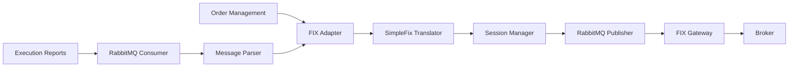

# FIX Protocol Integration

FXML4 provides native Financial Information eXchange (FIX) protocol support for connecting to institutional trading platforms and prime brokers. The implementation uses the lightweight `simplefix` library optimized for message bus architectures.

## Overview

The FIX adapter (`fxml4/brokers/adapters/fix_adapter.py`) provides:

- **FIX 4.2 Protocol Support**: Industry-standard messaging protocol
- **Session Management**: Automatic logon/logout and heartbeat handling
- **Message Translation**: Conversion between internal models and FIX messages
- **RabbitMQ Integration**: Asynchronous message processing
- **Mock Mode**: Testing without live broker connections

## Architecture



## Configuration

Configure FIX connectivity in `config/default.yaml`:

```yaml
brokers:
  adapters:
    fix:
      enabled: true
      host: "fix.broker.com"
      port: 9878

      # FIX Session Configuration
      sender_comp_id: "FXML4"
      target_comp_id: "BROKER"
      username: "your_username"
      password: "your_password"

      # Connection Settings
      heartbeat_interval: 30
      logon_timeout: 30

      # Message Queue
      rabbitmq:
        exchange: "fix_exchange"
        routing_key: "fix.orders"

      # Testing
      mock_mode: false
```

## Message Types Supported

### Outbound Messages

| Message Type | FIX Tag 35 | Description |
|--------------|------------|-------------|
| New Order Single | D | Submit new order |
| Order Cancel Request | F | Cancel existing order |
| Order Cancel/Replace | G | Modify existing order |
| Logon | A | Session authentication |
| Logout | 5 | Session termination |
| Heartbeat | 0 | Keep-alive message |

### Inbound Messages

| Message Type | FIX Tag 35 | Description |
|--------------|------------|-------------|
| Execution Report | 8 | Order status updates |
| Order Cancel Reject | 9 | Cancel rejection |
| Logon | A | Session confirmation |
| Logout | 5 | Session termination |
| Heartbeat | 0 | Keep-alive response |

## Usage Examples

### Basic Order Submission

```python
from fxml4.brokers.adapters.fix_adapter import FixBrokerAdapter
from fxml4.fix.messages.orders import NewOrderSingle
from fxml4.fix.messages.base import Side, OrdType

# Initialize adapter
adapter = FixBrokerAdapter(config)
await adapter.connect()

# Create order
order = NewOrderSingle(
    cl_ord_id="ORDER001",
    symbol="EURUSD",
    side=Side.BUY,
    order_qty=100000,
    ord_type=OrdType.MARKET
)

# Submit order
execution_id = await adapter.submit_order(order)
print(f"Order submitted: {execution_id}")
```

### Order Status Monitoring

```python
# Get order status
status = await adapter.get_order_status("ORDER001")
print(f"Order status: {status.ord_status}")

# Get all open orders
open_orders = await adapter.get_open_orders()
for order in open_orders:
    print(f"{order.cl_ord_id}: {order.ord_status}")
```

### Cancel Order

```python
# Cancel order
cancel_result = await adapter.cancel_order("ORDER001")
if cancel_result:
    print("Order cancelled successfully")
```

## Session Management

The FIX adapter handles session lifecycle automatically:

### Logon Process
1. Establish TCP connection
2. Send Logon message (35=A)
3. Validate credentials
4. Begin heartbeat sequence

### Heartbeat Handling
- Automatic heartbeat messages every 30 seconds
- Missing heartbeat detection
- Automatic session recovery

### Logout Process
1. Send Logout message (35=5)
2. Wait for confirmation
3. Close TCP connection

## Message Translation

The `SimpleFixTranslator` converts between internal order models and FIX messages:

### Order to FIX Message

```python
# Internal order model
order = NewOrderSingle(
    cl_ord_id="ORDER001",
    symbol="EURUSD",
    side=Side.BUY,
    order_qty=100000,
    ord_type=OrdType.LIMIT,
    price=1.1250
)

# Convert to FIX message
translator = SimpleFixTranslator()
fix_message = translator.to_simplefix(order)

# FIX message contains:
# 8=FIX.4.2|35=D|11=ORDER001|55=EURUSD|54=1|38=100000|40=2|44=1.1250
```

### FIX Message to Execution Report

```python
# Incoming FIX execution report
fix_msg = "8=FIX.4.2|35=8|11=ORDER001|17=EXEC001|150=0|39=0|..."

# Parse to execution report
execution = translator.from_simplefix(fix_msg)
print(f"Order {execution.cl_ord_id} filled at {execution.last_px}")
```

## Error Handling

The FIX adapter includes comprehensive error handling:

### Connection Errors
- Automatic reconnection with exponential backoff
- Session state preservation
- Message queue buffering during disconnection

### Message Errors
- FIX parsing validation
- Business logic rejection handling
- Audit logging of all errors

### Session Errors
- Invalid logon handling
- Sequence number gap detection
- Heartbeat timeout recovery

## Testing

### Mock Mode

For testing without live broker connections:

```python
# Enable mock mode
config = {
    "mock_mode": True,
    "mock_responses": {
        "execution_delay": 1.0,  # seconds
        "fill_probability": 0.95
    }
}

adapter = FixBrokerAdapter(config)
await adapter.connect()  # Simulated connection

# Orders will be auto-filled in mock mode
```

### Integration Tests

```bash
# Run FIX adapter tests
pytest tests/brokers/test_fix_adapter.py -v

# Test with mock broker
python scripts/test_fix_workflow.py --mock
```

## Monitoring

### Connection Status

```python
# Check connection health
health = await adapter.get_health()
print(f"Connected: {health['connected']}")
print(f"Session active: {health['session_active']}")
print(f"Messages sent: {health['messages_sent']}")
```

### Message Statistics

The adapter tracks detailed statistics:

- Messages sent/received
- Average response time
- Error rates
- Session uptime

## Security Considerations

### Credentials Management
- Store FIX credentials in secure environment variables
- Use encrypted configuration files
- Rotate passwords regularly

### Network Security
- Use VPN or dedicated network connections
- Enable TLS encryption if supported
- Implement IP whitelisting

### Audit Requirements
- All FIX messages are logged with integrity hashes
- Session events are audited
- Order flow is tracked end-to-end

## Troubleshooting

### Common Issues

**Connection Refused**
```
Check network connectivity to FIX gateway
Verify host/port configuration
Confirm credentials are correct
```

**Sequence Number Mismatch**
```
Reset sequence numbers on both sides
Check for missing messages
Review session logs for gaps
```

**Heartbeat Timeout**
```
Verify network stability
Check heartbeat interval configuration
Monitor system resource usage
```

## See Also

- [Broker Adapters](adapters.md)
- [Risk Management Integration](../risk-management/index.md)
- [API Reference](../../api-reference/endpoints/brokers.md)
- [FIX Protocol Specification](https://www.fixtrading.org/)
