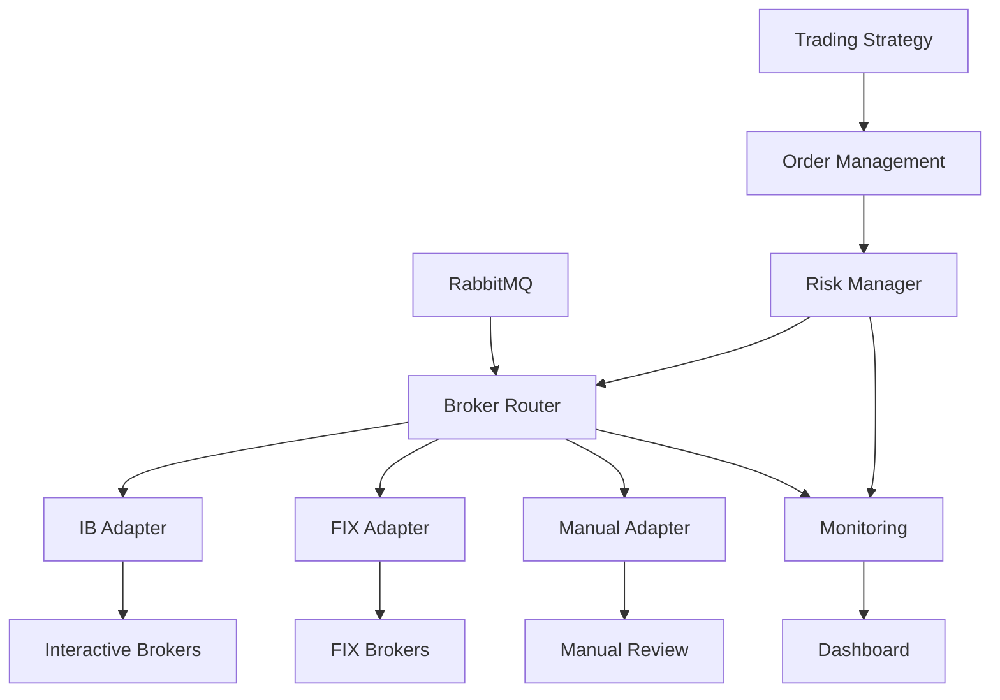

# Broker Integration

FXML4's broker integration system provides a unified interface for connecting to multiple trading brokers through a standardized adapter pattern. This architecture ensures consistent order management, risk controls, and compliance monitoring across all broker connections.

## Overview

The broker integration system consists of several key components:

- **Broker Adapters**: Standardized interfaces for different brokers
- **FIX Protocol Support**: Native FIX message handling for institutional brokers
- **Message Queue Integration**: RabbitMQ-based asynchronous processing
- **Risk Management**: Pre-trade risk checks and position monitoring
- **Manual Execution**: Web-based order approval interface
- **Monitoring Dashboard**: Real-time system health and performance tracking

## Architecture



## Key Features

### Multi-Broker Support
- **Interactive Brokers**: Full TWS/Gateway integration
- **Native FIX**: Direct FIX protocol connectivity
- **Manual Execution**: Human-in-the-loop order processing
- **Extensible Framework**: Easy addition of new brokers

### Risk Management Integration
- Pre-trade risk checks on all orders
- Position limit enforcement
- Real-time exposure monitoring
- Risk override capabilities with audit trails

### Compliance & Audit
- Comprehensive audit logging with integrity verification
- Regulatory compliance checks (SEC, MiFID II, FISCA)
- Transaction monitoring for AML/suspicious activity
- Automated reporting in multiple formats

### Monitoring & Observability
- Real-time dashboard with WebSocket updates
- Order flow visualization
- Performance metrics and health checks
- Alert management system

## Getting Started

1. [Configure your brokers](adapters.md)
2. [Set up FIX connectivity](fix-protocol.md)
3. [Configure risk limits](../risk-management/index.md)
4. [Access the monitoring dashboard](monitoring.md)

## Configuration

Broker adapters are configured in `config/default.yaml`:

```yaml
brokers:
  adapters:
    ib:
      enabled: true
      host: "127.0.0.1"
      port: 7497
      client_id: 1

    fix:
      enabled: true
      host: "fix.broker.com"
      port: 9878
      sender_comp_id: "FXML4"
      target_comp_id: "BROKER"

    manual:
      enabled: true
      auto_reject_timeout: 300
```

## See Also

- [Risk Management](../risk-management/index.md)
- [Compliance & Audit](../compliance/index.md)
- [API Reference](../../api-reference/endpoints/brokers.md)
