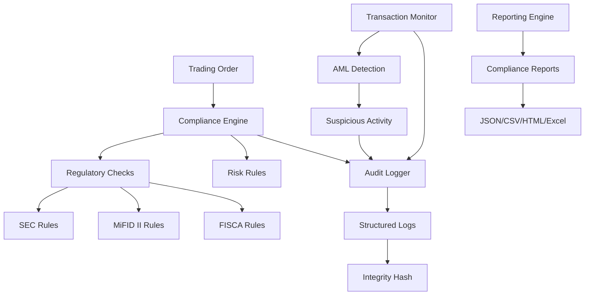

# Compliance & Audit Framework

FXML4 provides a comprehensive compliance and audit framework designed to meet regulatory requirements across multiple jurisdictions. The system ensures real-time compliance monitoring, complete audit trails, and automated reporting for regulatory oversight.

## Overview

The compliance framework consists of four main components:

1. **Audit Logger**: Structured logging with integrity verification
2. **Compliance Engine**: Real-time rule-based compliance checking
3. **Regulatory Checks**: Jurisdiction-specific compliance rules
4. **Transaction Monitor**: AML and suspicious activity detection
5. **Reporting System**: Automated compliance reporting

## Architecture



## Key Features

### Real-time Compliance Monitoring
- Pre-trade compliance checks on all orders
- 8 types of compliance rules (position limits, concentration, velocity, etc.)
- Automatic order blocking for critical violations
- Manual review workflows for complex cases

### Regulatory Framework Support
- **SEC (US)**: Position reporting, Large Trader rules, Pattern Day Trading, Best Execution
- **MiFID II (EU)**: Client classification, suitability, transparency, product governance
- **FISCA (Singapore)**: Leverage limits, margin requirements, client money protection

### Anti-Money Laundering (AML)
- 13 types of suspicious activity detection
- Wash trading, layering, spoofing detection
- Structuring and smurfing identification
- Risk-based transaction monitoring

### Audit & Reporting
- SHA-256 integrity verification for all audit events
- Comprehensive audit trails across 8 categories
- Automated report generation in multiple formats
- Real-time compliance dashboards

## Configuration

Configure compliance rules in `config/compliance.yaml`:

```yaml
compliance:
  engine:
    enable_blocking: true
    alert_threshold: 0.7

  rules:
    position_limits:
      enabled: true
      limits:
        EURUSD: 10000000  # $10M
        GBPUSD: 5000000   # $5M
        default: 1000000  # $1M

    concentration:
      enabled: true
      max_concentration_pct: 25.0

    velocity:
      enabled: true
      max_orders_per_minute: 60
      max_orders_per_hour: 1000

  regulatory:
    jurisdictions:
      - SEC
      - MIFID_II
      - FISCA

  transaction_monitoring:
    monitoring_window: 24  # hours
    alert_threshold: 0.7

  audit:
    log_directory: "logs/audit"
    max_file_size: 52428800  # 50MB
    backup_count: 10
```

## Core Components

### 1. Audit Logger

Provides structured audit logging with integrity verification:

```python
from fxml4.brokers.compliance.audit_logger import AuditLogger

# Initialize audit logger
audit_logger = AuditLogger(audit_dir="logs/audit")

# Log trading event
await audit_logger.log_trade_event(
    event_type="ORDER_SUBMITTED",
    message="New order submitted",
    cl_ord_id="ORDER001",
    symbol="EURUSD",
    details={
        "quantity": 100000,
        "price": 1.1250,
        "side": "BUY"
    }
)
```

### 2. Compliance Engine

Real-time compliance checking with configurable rules:

```python
from fxml4.brokers.compliance.compliance_engine import ComplianceEngine

# Initialize compliance engine
engine = ComplianceEngine(audit_logger=audit_logger)

# Add compliance rules
engine.add_rule(PositionLimitRule(position_limits))
engine.add_rule(ConcentrationRule(max_concentration_pct=25.0))

# Check order compliance
result, violations = await engine.check_order_compliance(order, context)
if result == ComplianceResult.BLOCKED:
    print(f"Order blocked: {[v.message for v in violations]}")
```

### 3. Transaction Monitor

Suspicious activity detection for AML compliance:

```python
from fxml4.brokers.compliance.transaction_monitor import TransactionMonitor

# Initialize transaction monitor
monitor = TransactionMonitor(audit_logger=audit_logger)

# Monitor transaction
alerts = await monitor.monitor_transaction({
    "client_id": "CLIENT001",
    "symbol": "EURUSD",
    "quantity": 100000,
    "price": 1.1250,
    "side": "BUY"
})

for alert in alerts:
    print(f"Suspicious activity detected: {alert.description}")
```

### 4. Reporting System

Automated compliance reporting:

```python
from fxml4.brokers.compliance.reporting import ComplianceReporter

# Initialize reporter
reporter = ComplianceReporter(engine, monitor, audit_logger)

# Generate daily compliance report
config = ReportConfig(
    report_type=ReportType.DAILY_COMPLIANCE,
    format=ReportFormat.HTML,
    start_date=datetime.now() - timedelta(days=1),
    end_date=datetime.now()
)

report = await reporter.generate_report(config)
print(f"Report generated: {report['output_file']}")
```

## Compliance Rules

### Position Limits
- Maximum position size per symbol
- Portfolio-level exposure limits
- Automatic blocking when limits exceeded

### Concentration Limits
- Maximum percentage of portfolio in single symbol
- Real-time concentration monitoring
- Manual review triggers

### Trading Hours
- Symbol-specific trading windows
- Timezone-aware validation
- Automatic order rejection outside hours

### Velocity Controls
- Orders per minute/hour limits
- Rate limiting with configurable thresholds
- Temporary blocking for excessive activity

### Regulatory Compliance
- Jurisdiction-specific rule enforcement
- Client classification requirements
- Suitability and appropriateness checks

## Suspicious Activity Detection

### Wash Trading
- Detection of trades at similar prices
- Pattern matching across time windows
- Confidence scoring and risk assessment

### Layering
- Multiple orders at different price levels
- Intent to manipulate order book
- Algorithmic pattern detection

### Structuring
- Breaking large amounts into smaller transactions
- Just-under-threshold transaction patterns
- Statistical variance analysis

### Other Patterns
- Round-trip trading
- Rapid trading sequences
- Spoofing (order placement with intent to cancel)
- Front running detection

## Audit Categories

The system tracks audit events across 8 categories:

1. **SYSTEM**: Application lifecycle, configuration changes
2. **TRADING**: Order submission, executions, cancellations
3. **RISK**: Risk limit breaches, override actions
4. **COMPLIANCE**: Rule violations, regulatory checks
5. **SECURITY**: Authentication, authorization events
6. **CONFIGURATION**: System settings changes
7. **USER_ACTION**: Manual user interventions
8. **EXTERNAL_API**: Third-party service interactions

## Reporting Capabilities

### Report Types
- Daily compliance summary
- Suspicious activity reports
- Audit trail exports
- Regulatory summary reports
- Risk violation reports
- Transaction analysis
- Position reporting
- Best execution reports

### Output Formats
- **JSON**: Machine-readable structured data
- **CSV**: Spreadsheet import/analysis
- **HTML**: Web-viewable reports with styling
- **PDF**: Print-ready formatted reports
- **Excel**: Multi-sheet workbooks with formatting

## Integration Examples

### Pre-Trade Compliance Check

```python
async def submit_order_with_compliance(order):
    # Check compliance before submission
    result, violations = await compliance_engine.check_order_compliance(
        order,
        context={
            "positions": get_current_positions(),
            "portfolio_value": get_portfolio_value(),
            "regulatory_context": get_regulatory_context(order.client_id)
        }
    )

    if result == ComplianceResult.BLOCKED:
        raise ComplianceViolationError(violations)
    elif result == ComplianceResult.REQUIRES_APPROVAL:
        await request_manual_approval(order, violations)

    # Submit order if compliant
    return await broker_adapter.submit_order(order)
```

### Real-Time Monitoring

```python
async def monitor_trading_activity():
    while True:
        # Get recent transactions
        transactions = await get_recent_transactions()

        # Monitor each transaction
        for transaction in transactions:
            alerts = await transaction_monitor.monitor_transaction(transaction)

            for alert in alerts:
                if alert.risk_level == RiskLevel.CRITICAL:
                    await escalate_alert(alert)
                else:
                    await log_alert(alert)

        await asyncio.sleep(60)  # Check every minute
```

## Regulatory Compliance

### SEC (United States)
- **Position Reporting**: 13D/13G filing requirements
- **Large Trader**: Registration and identification
- **Pattern Day Trading**: Minimum equity requirements
- **Best Execution**: Order routing analysis

### MiFID II (European Union)
- **Client Classification**: Professional vs retail determination
- **Suitability**: Investment advice requirements
- **Transparency**: Large-in-scale order handling
- **Product Governance**: Target market definition

### FISCA (Singapore)
- **Leverage Limits**: Client-type specific restrictions
- **Margin Requirements**: Margin call and stop-out levels
- **Client Money**: Segregation requirements

## Performance Considerations

### Real-Time Processing
- Sub-millisecond compliance checks
- Asynchronous audit logging
- Efficient pattern matching algorithms
- Configurable monitoring windows

### Scalability
- Horizontal scaling support
- Database optimization for audit queries
- Efficient memory usage for pattern detection
- Configurable retention policies

### High Availability
- Redundant compliance checking
- Automatic failover capabilities
- Graceful degradation modes
- Comprehensive health monitoring

## See Also

- [Audit Logging](audit-logging.md)
- [Compliance Engine](compliance-engine.md)
- [Regulatory Checks](regulatory-checks.md)
- [Transaction Monitoring](transaction-monitoring.md)
- [Reporting](reporting.md)
- [Risk Management](../risk-management/index.md)
