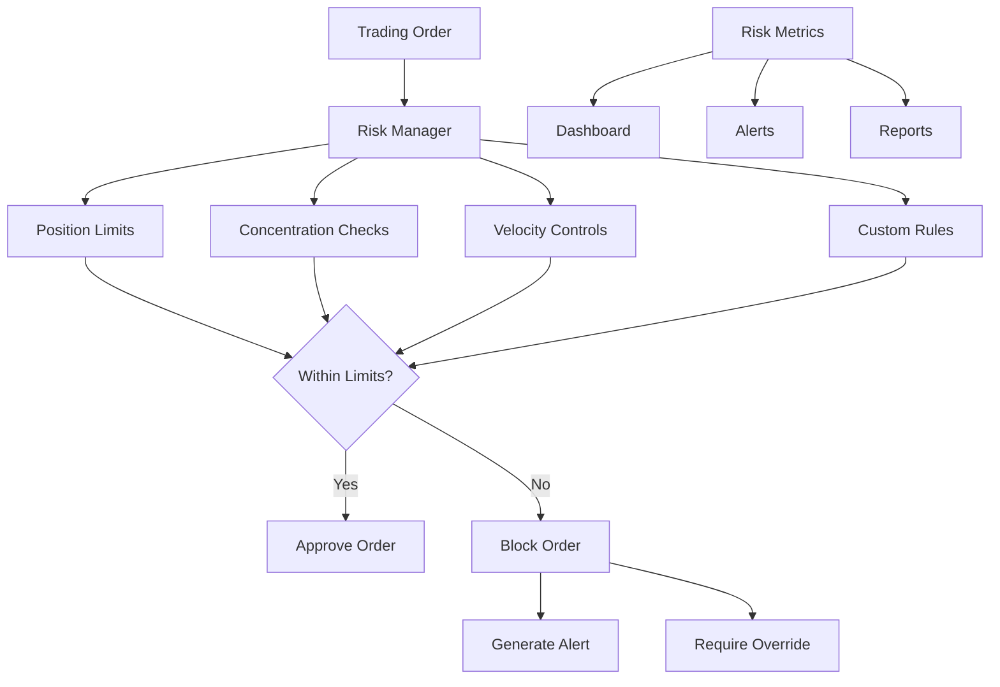

# Risk Management

FXML4's risk management system provides comprehensive pre-trade and post-trade risk controls designed to protect against excessive losses and ensure compliance with risk policies. The system operates in real-time and integrates seamlessly with all broker adapters.

## Overview

The risk management framework consists of:

- **Pre-Trade Risk Checks**: Validate orders before submission
- **Position Monitoring**: Real-time exposure tracking
- **Limit Enforcement**: Automatic blocking of limit violations
- **Override Mechanisms**: Authorized manual interventions
- **Risk Reporting**: Comprehensive risk metrics and alerts

## Architecture



## Core Components

### 1. Risk Manager

The central risk management engine that orchestrates all risk checks:

```python
from fxml4.brokers.risk.manager import FXRiskManager

# Initialize risk manager
risk_manager = FXRiskManager(
    limits_config="config/risk_limits.yaml",
    audit_logger=audit_logger
)

# Check order risk
is_approved, violations = await risk_manager.check_order(order)
if not is_approved:
    print(f"Order blocked: {[v.message for v in violations]}")
```

### 2. Risk Limits Configuration

Risk limits are defined in `config/risk_limits.yaml`:

```yaml
risk_limits:
  # Position limits by symbol (in base currency)
  position_limits:
    EURUSD: 10000000      # $10M max position
    GBPUSD: 5000000       # $5M max position
    USDJPY: 8000000       # $8M max position
    default: 1000000      # $1M default limit

  # Portfolio-level limits
  portfolio:
    max_total_exposure: 50000000    # $50M total
    max_daily_loss: 1000000         # $1M daily loss limit
    max_concentration_pct: 25.0     # 25% max per symbol

  # Order limits
  order_limits:
    max_order_size: 5000000         # $5M max single order
    max_orders_per_minute: 60       # Rate limiting
    max_orders_per_hour: 1000

  # Client-specific limits
  client_limits:
    CLIENT001:
      max_position: 2000000         # $2M max position
      max_daily_volume: 10000000    # $10M daily volume
```

### 3. Risk Checks

#### Position Limit Checks

Prevents positions from exceeding configured limits:

```python
class PositionLimitCheck(RiskCheck):
    async def check(self, order, limits, metrics):
        current_position = metrics.get_position(order.symbol)
        new_position = self._calculate_new_position(order, current_position)

        limit = limits.get_position_limit(order.symbol)
        if abs(new_position) > limit:
            return RiskViolation(
                check_type="POSITION_LIMIT",
                message=f"Position limit exceeded for {order.symbol}",
                severity=RiskSeverity.HIGH,
                suggested_action="Reduce order size"
            )
        return None
```

#### Concentration Risk Checks

Monitors portfolio concentration to prevent over-exposure:

```python
class ConcentrationCheck(RiskCheck):
    async def check(self, order, limits, metrics):
        portfolio_value = metrics.get_portfolio_value()
        new_exposure = self._calculate_new_exposure(order, metrics)

        concentration_pct = (new_exposure / portfolio_value) * 100
        max_concentration = limits.max_concentration_pct

        if concentration_pct > max_concentration:
            return RiskViolation(
                check_type="CONCENTRATION_LIMIT",
                message=f"Concentration limit exceeded: {concentration_pct:.1f}%",
                severity=RiskSeverity.MEDIUM
            )
        return None
```

#### Velocity Controls

Rate limiting to prevent excessive order submission:

```python
class VelocityCheck(RiskCheck):
    async def check(self, order, limits, metrics):
        recent_orders = metrics.get_recent_orders(minutes=1)

        if len(recent_orders) >= limits.max_orders_per_minute:
            return RiskViolation(
                check_type="VELOCITY_LIMIT",
                message="Order submission rate too high",
                severity=RiskSeverity.HIGH,
                suggested_action="Reduce order frequency"
            )
        return None
```

## Risk Violation Handling

### Automatic Blocking

Orders that violate critical risk limits are automatically blocked:

```python
if violation.severity in [RiskSeverity.HIGH, RiskSeverity.CRITICAL]:
    # Block order automatically
    await risk_manager.block_order(order.cl_ord_id, violation)

    # Send alert
    await alert_manager.send_risk_alert(violation)
```

### Manual Override Process

Authorized users can override risk blocks with proper justification:

```python
# Request override
override_request = RiskOverrideRequest(
    order_id="ORDER_001",
    override_authority=RiskAuthority.SENIOR_TRADER,
    justification="Client hedging requirement",
    requested_by="senior.trader@fxml4.com"
)

# Process override
override_result = await risk_manager.process_override(override_request)
if override_result.approved:
    await risk_manager.unblock_order(order.cl_ord_id)
```

## Risk Metrics and Monitoring

### Real-time Risk Metrics

The system tracks comprehensive risk metrics:

```python
class RiskMetrics:
    # Position metrics
    current_positions: Dict[str, Position]
    total_exposure: float
    net_exposure: float
    gross_exposure: float

    # P&L metrics
    unrealized_pnl: float
    realized_pnl: float
    daily_pnl: float

    # Utilization metrics
    position_utilization: Dict[str, float]  # % of limit used
    concentration_levels: Dict[str, float]

    # Violation tracking
    recent_violations: List[RiskViolation]
    blocked_orders: List[str]
```

### Risk Dashboard

Real-time risk monitoring through the web dashboard:

- **Position Heat Map**: Visual representation of position sizes
- **Limit Utilization**: Progress bars showing limit usage
- **Violation Alerts**: Real-time risk violation notifications
- **P&L Tracking**: Continuous profit/loss monitoring

## Integration with Broker Adapters

Risk checks are integrated into the order submission workflow:

```python
class BrokerAdapter:
    async def submit_order(self, order):
        # Pre-trade risk check
        is_approved, violations = await self.risk_manager.check_order(order)

        if not is_approved:
            raise RiskViolationError(violations)

        # Submit to broker
        execution_id = await self._submit_to_broker(order)

        # Update risk metrics
        await self.risk_manager.update_metrics(order, execution_id)

        return execution_id
```

## Custom Risk Rules

Create custom risk rules for specific requirements:

```python
class CustomLeverageCheck(RiskCheck):
    def __init__(self, max_leverage: float):
        self.max_leverage = max_leverage

    async def check(self, order, limits, metrics):
        account_equity = metrics.get_account_equity()
        new_exposure = metrics.calculate_total_exposure_after_order(order)
        leverage = new_exposure / account_equity

        if leverage > self.max_leverage:
            return RiskViolation(
                check_type="LEVERAGE_LIMIT",
                message=f"Leverage limit exceeded: {leverage:.1f}x",
                severity=RiskSeverity.HIGH
            )
        return None

# Add custom rule to risk manager
risk_manager.add_check(CustomLeverageCheck(max_leverage=10.0))
```

## Loss Monitoring

### Stop Loss Integration

Automatic stop loss execution when limits are breached:

```python
class StopLossManager:
    async def monitor_positions(self):
        for position in self.get_open_positions():
            current_pnl = position.calculate_pnl()

            if current_pnl <= position.stop_loss_amount:
                # Execute stop loss
                stop_order = self.create_stop_loss_order(position)
                await self.broker.submit_order(stop_order)
```

### Daily Loss Limits

Automatic trading suspension when daily loss limits are reached:

```python
async def check_daily_loss_limit(self):
    daily_pnl = self.metrics.get_daily_pnl()
    daily_loss_limit = self.limits.max_daily_loss

    if abs(daily_pnl) >= daily_loss_limit:
        # Suspend trading
        await self.suspend_trading("Daily loss limit reached")

        # Close all positions
        await self.close_all_positions()

        # Alert management
        await self.send_emergency_alert(daily_pnl, daily_loss_limit)
```

## Risk Reporting

### Daily Risk Report

Generate comprehensive daily risk reports:

```python
from fxml4.brokers.risk.reporting import RiskReporter

reporter = RiskReporter(risk_manager, metrics)

daily_report = await reporter.generate_daily_report(
    date=datetime.now().date(),
    format="HTML"
)

print(f"Report saved: {daily_report.output_file}")
```

### Risk Analytics

Advanced risk analytics and stress testing:

```python
class RiskAnalytics:
    def calculate_var(self, confidence_level=0.95, holding_period=1):
        """Calculate Value at Risk."""

    def stress_test_portfolio(self, scenarios):
        """Run stress test scenarios."""

    def correlation_analysis(self):
        """Analyze position correlations."""
```

## Configuration Examples

### Conservative Risk Profile

```yaml
risk_limits:
  position_limits:
    default: 500000          # $500K max position

  portfolio:
    max_total_exposure: 10000000    # $10M total
    max_daily_loss: 200000          # $200K daily limit
    max_concentration_pct: 15.0     # 15% max concentration

  order_limits:
    max_order_size: 1000000         # $1M max order
    max_orders_per_minute: 30
```

### Aggressive Risk Profile

```yaml
risk_limits:
  position_limits:
    default: 20000000        # $20M max position

  portfolio:
    max_total_exposure: 100000000   # $100M total
    max_daily_loss: 5000000         # $5M daily limit
    max_concentration_pct: 40.0     # 40% max concentration

  order_limits:
    max_order_size: 10000000        # $10M max order
    max_orders_per_minute: 100
```

## Performance Considerations

### Optimization Techniques

- **Async Processing**: All risk checks are asynchronous
- **Caching**: Position and metric caching for fast lookups
- **Batch Processing**: Bulk risk calculations for efficiency
- **Memory Management**: Efficient data structures for large portfolios

### Scalability

- **Horizontal Scaling**: Risk checks can be distributed
- **Database Optimization**: Indexed queries for position lookups
- **Real-time Processing**: Sub-millisecond risk check response times

## See Also

- [Pre-Trade Checks](pre-trade-checks.md)
- [Position Limits](position-limits.md)
- [Risk Overrides](overrides.md)
- [Monitoring Dashboard](monitoring.md)
- [Compliance Integration](../compliance/index.md)
