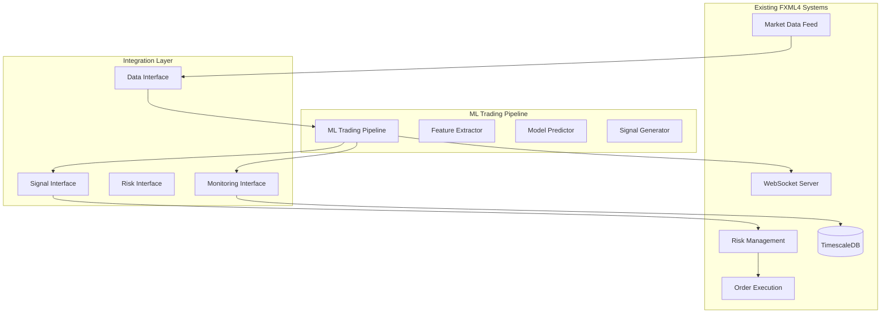

# ML Trading Pipeline Integration Guide

## Overview

This guide provides step-by-step instructions for integrating the ML Trading Pipeline with existing FXML4 systems. The integration is designed to be modular and non-disruptive, allowing gradual adoption while maintaining full compatibility with existing trading workflows.

## Prerequisites

### System Requirements

**Hardware Requirements:**
- CPU: 4+ cores (Intel i5/AMD Ryzen 5 or better)
- Memory: 8GB+ RAM (16GB recommended for production)
- Storage: 10GB+ available space for models and logs
- Network: Stable connection for real-time data feeds

**Software Requirements:**
- Python 3.9+ with pip package manager
- PostgreSQL 12+ or TimescaleDB for time-series data
- Redis 6+ for caching and session management
- RabbitMQ 3.8+ for message queuing
- Docker and Docker Compose (optional, for containerized deployment)

### Required Dependencies

Install the ML pipeline dependencies:

```bash
# Core ML dependencies
pip install scikit-learn>=1.3.0
pip install xgboost>=1.7.0
pip install tensorflow>=2.13.0
pip install pandas>=2.0.0
pip install numpy>=1.24.0

# Technical analysis libraries
pip install ta>=0.10.0
pip install pandas-ta>=0.3.14b

# WebSocket and async support
pip install websockets>=11.0
pip install aiohttp>=3.8.0

# Monitoring and logging
pip install prometheus-client>=0.17.0
pip install structlog>=23.1.0
```

Or install all at once:

```bash
pip install -r requirements-ml.txt
```

### Environment Configuration

Create or update your `.env` file with ML-specific configurations:

```bash
# ML Pipeline Configuration
ML_ENABLED=true
ML_MODELS=random_forest,xgboost,lstm
ML_CONFIDENCE_THRESHOLD=0.7
ML_LOOKBACK_PERIOD=50
ML_BATCH_SIZE=100

# Model Storage
ML_MODEL_PATH=/app/models
ML_MODEL_REGISTRY_URL=http://localhost:5000/api/models

# Performance Settings
ML_MAX_WORKERS=4
ML_CACHE_TTL=60
ML_UPDATE_FREQUENCY=1000

# Risk Management
ML_MAX_POSITION_SIZE=0.05
ML_STOP_LOSS_PCT=0.02
ML_TAKE_PROFIT_PCT=0.04

# Monitoring
ML_METRICS_ENABLED=true
ML_METRICS_PORT=9090
ML_LOG_LEVEL=INFO
```

## Integration Architecture

### System Architecture Overview

The ML Trading Pipeline integrates with FXML4 through well-defined interfaces:



### Integration Points

The ML pipeline integrates with existing systems through four main interfaces:

1. **Data Interface**: Receives market data from existing feeds
2. **Signal Interface**: Sends trading signals to risk management
3. **Risk Interface**: Respects existing risk limits and controls
4. **Monitoring Interface**: Provides metrics and health status

## Step-by-Step Integration

### Step 1: Database Schema Updates

First, create the necessary database tables for ML pipeline data:

```sql
-- ML signals table
CREATE TABLE ml_signals (
    id SERIAL PRIMARY KEY,
    symbol VARCHAR(20) NOT NULL,
    signal_type VARCHAR(10) NOT NULL, -- 'BUY', 'SELL', 'HOLD'
    confidence DECIMAL(5,4) NOT NULL,
    position_size DECIMAL(10,6),
    entry_price DECIMAL(15,8),
    stop_loss DECIMAL(15,8),
    take_profit DECIMAL(15,8),
    models_used TEXT[],
    features_used TEXT[],
    prediction_details JSONB,
    risk_metrics JSONB,
    created_at TIMESTAMP WITH TIME ZONE DEFAULT NOW(),
    status VARCHAR(20) DEFAULT 'PENDING'
);

-- ML model performance table
CREATE TABLE ml_model_performance (
    id SERIAL PRIMARY KEY,
    model_name VARCHAR(50) NOT NULL,
    prediction DECIMAL(8,6),
    actual DECIMAL(8,6),
    accuracy DECIMAL(8,6),
    timestamp TIMESTAMP WITH TIME ZONE DEFAULT NOW(),
    symbol VARCHAR(20),
    performance_metrics JSONB
);

-- ML pipeline status table
CREATE TABLE ml_pipeline_status (
    id SERIAL PRIMARY KEY,
    component VARCHAR(50) NOT NULL,
    status VARCHAR(20) NOT NULL,
    last_update TIMESTAMP WITH TIME ZONE DEFAULT NOW(),
    error_message TEXT,
    performance_metrics JSONB
);

-- Create indexes for performance
CREATE INDEX idx_ml_signals_symbol_created ON ml_signals(symbol, created_at);
CREATE INDEX idx_ml_signals_status ON ml_signals(status);
CREATE INDEX idx_ml_performance_model_timestamp ON ml_model_performance(model_name, timestamp);
CREATE INDEX idx_ml_status_component ON ml_pipeline_status(component);
```

### Step 2: Configuration Integration

Create ML-specific configuration module that integrates with existing FXML4 config:

```python
# config/ml_config.py
from typing import Dict, List, Any, Optional
from core.config.base_config import BaseConfig
import os

class MLConfig(BaseConfig):
    """ML Pipeline configuration management."""

    def __init__(self):
        super().__init__()
        self.ml_config = self._load_ml_config()

    def _load_ml_config(self) -> Dict[str, Any]:
        """Load ML-specific configuration."""
        return {
            # Core ML Settings
            'enabled': self._get_bool('ML_ENABLED', True),
            'models': self._get_list('ML_MODELS', ['random_forest', 'xgboost']),
            'confidence_threshold': self._get_float('ML_CONFIDENCE_THRESHOLD', 0.7),
            'lookback_period': self._get_int('ML_LOOKBACK_PERIOD', 50),

            # Features Configuration
            'features': self._get_list('ML_FEATURES', ['sma', 'rsi', 'macd', 'volume_profile']),
            'feature_normalization': self._get_bool('ML_FEATURE_NORMALIZATION', True),

            # Model Configuration
            'model_path': self._get_string('ML_MODEL_PATH', '/app/models'),
            'model_registry_url': self._get_string('ML_MODEL_REGISTRY_URL', None),
            'auto_retrain': self._get_bool('ML_AUTO_RETRAIN', False),

            # Performance Settings
            'batch_size': self._get_int('ML_BATCH_SIZE', 100),
            'max_workers': self._get_int('ML_MAX_WORKERS', 4),
            'cache_ttl': self._get_int('ML_CACHE_TTL', 60),
            'update_frequency': self._get_int('ML_UPDATE_FREQUENCY', 1000),

            # Risk Management
            'max_position_size': self._get_float('ML_MAX_POSITION_SIZE', 0.05),
            'stop_loss_pct': self._get_float('ML_STOP_LOSS_PCT', 0.02),
            'take_profit_pct': self._get_float('ML_TAKE_PROFIT_PCT', 0.04),
            'risk_free_rate': self._get_float('ML_RISK_FREE_RATE', 0.02),

            # Monitoring
            'metrics_enabled': self._get_bool('ML_METRICS_ENABLED', True),
            'metrics_port': self._get_int('ML_METRICS_PORT', 9090),
            'log_level': self._get_string('ML_LOG_LEVEL', 'INFO')
        }

    def get_pipeline_config(self) -> Dict[str, Any]:
        """Get configuration for ML pipeline initialization."""
        return {
            'models': self.ml_config['models'],
            'features': self.ml_config['features'],
            'lookback_period': self.ml_config['lookback_period'],
            'confidence_threshold': self.ml_config['confidence_threshold'],
            'max_position_size': self.ml_config['max_position_size'],
            'stop_loss_pct': self.ml_config['stop_loss_pct'],
            'take_profit_pct': self.ml_config['take_profit_pct']
        }
```

### Step 3: Data Feed Integration

Integrate the ML pipeline with existing market data feeds:

```python
# core/integrations/ml_data_adapter.py
import asyncio
import pandas as pd
from typing import Optional, Dict, Any
from datetime import datetime, timedelta

from core.data.market_data_feed import MarketDataFeed
from core.ml.ml_trading_pipeline import MLTradingPipeline
from core.database.database_manager import DatabaseManager
from core.logging.logger import get_logger

logger = get_logger(__name__)

class MLDataAdapter:
    """Adapter for integrating ML pipeline with existing data feeds."""

    def __init__(
        self,
        ml_pipeline: MLTradingPipeline,
        data_feed: MarketDataFeed,
        db_manager: DatabaseManager
    ):
        self.ml_pipeline = ml_pipeline
        self.data_feed = data_feed
        self.db_manager = db_manager
        self.is_running = False
        self.symbols = []

    async def start_integration(self, symbols: List[str]):
        """Start ML pipeline integration with data feeds."""
        self.symbols = symbols
        self.is_running = True

        logger.info(f"Starting ML data integration for symbols: {symbols}")

        # Start processing for each symbol
        tasks = []
        for symbol in symbols:
            task = asyncio.create_task(self._process_symbol(symbol))
            tasks.append(task)

        await asyncio.gather(*tasks)

    async def _process_symbol(self, symbol: str):
        """Process ML pipeline for a specific symbol."""
        logger.info(f"Starting ML processing for {symbol}")

        while self.is_running:
            try:
                # Get latest market data
                market_data = await self._get_market_data(symbol)

                if market_data is not None and len(market_data) >= 50:
                    # Process through ML pipeline
                    signal = await self.ml_pipeline.process_market_data(market_data)

                    if signal and signal['confidence'] >= self.ml_pipeline.config.get('confidence_threshold', 0.7):
                        # Store signal in database
                        await self._store_signal(signal)

                        # Send to existing trading system
                        await self._send_to_trading_system(signal)

                        logger.info(f"Generated {signal['signal']} signal for {symbol} with confidence {signal['confidence']:.3f}")

                # Wait before next update
                await asyncio.sleep(self.ml_pipeline.config.get('update_frequency', 1000) / 1000)

            except Exception as e:
                logger.error(f"Error processing {symbol}: {str(e)}")
                await asyncio.sleep(5)  # Wait before retry

    async def _get_market_data(self, symbol: str) -> Optional[pd.DataFrame]:
        """Get historical market data for ML processing."""
        try:
            # Get data from existing data feed
            end_time = datetime.now()
            start_time = end_time - timedelta(hours=100)  # Get enough data for features

            data = await self.data_feed.get_historical_data(
                symbol=symbol,
                start_time=start_time,
                end_time=end_time,
                timeframe='1h'
            )

            return data

        except Exception as e:
            logger.error(f"Error getting market data for {symbol}: {str(e)}")
            return None

    async def _store_signal(self, signal: Dict[str, Any]):
        """Store ML signal in database."""
        try:
            query = """
                INSERT INTO ml_signals (
                    symbol, signal_type, confidence, position_size,
                    entry_price, stop_loss, take_profit, models_used,
                    features_used, prediction_details, risk_metrics
                ) VALUES ($1, $2, $3, $4, $5, $6, $7, $8, $9, $10, $11)
            """

            await self.db_manager.execute(
                query,
                signal['symbol'],
                signal['signal'],
                signal['confidence'],
                signal['position_size'],
                signal['entry_price'],
                signal['stop_loss'],
                signal['take_profit'],
                signal.get('models_used', []),
                signal.get('features_used', []),
                signal.get('prediction_details', {}),
                signal.get('risk_metrics', {})
            )

        except Exception as e:
            logger.error(f"Error storing signal: {str(e)}")

    async def _send_to_trading_system(self, signal: Dict[str, Any]):
        """Send signal to existing trading system."""
        try:
            # Integration with existing order management system
            from core.trading.order_manager import OrderManager

            order_manager = OrderManager()

            # Create order request from ML signal
            order_request = {
                'symbol': signal['symbol'],
                'side': signal['signal'].lower(),  # 'buy' or 'sell'
                'quantity': signal['position_size'],
                'order_type': 'market',
                'stop_loss': signal['stop_loss'],
                'take_profit': signal['take_profit'],
                'source': 'ml_pipeline',
                'metadata': {
                    'confidence': signal['confidence'],
                    'models_used': signal.get('models_used', []),
                    'ml_signal_id': signal.get('id')
                }
            }

            # Submit to existing order management system
            if signal['signal'] in ['BUY', 'SELL']:
                await order_manager.submit_order(order_request)
                logger.info(f"Submitted ML order: {order_request}")

        except Exception as e:
            logger.error(f"Error sending signal to trading system: {str(e)}")

    def stop(self):
        """Stop the ML integration."""
        self.is_running = False
        logger.info("Stopped ML data integration")
```

### Step 4: Risk Management Integration

Integrate ML signals with existing risk management system:

```python
# core/integrations/ml_risk_integration.py
from typing import Dict, Any, Optional
from decimal import Decimal

from core.risk.risk_manager import RiskManager
from core.ml.signal_generator import SignalGenerator
from core.logging.logger import get_logger

logger = get_logger(__name__)

class MLRiskIntegration:
    """Integration between ML signals and existing risk management."""

    def __init__(self, risk_manager: RiskManager):
        self.risk_manager = risk_manager

    async def validate_ml_signal(
        self,
        signal: Dict[str, Any],
        account_info: Dict[str, Any]
    ) -> Dict[str, Any]:
        """Validate ML signal against existing risk rules."""

        validation_result = {
            'approved': False,
            'adjusted_signal': signal.copy(),
            'risk_warnings': [],
            'adjustments_made': []
        }

        try:
            # Check position limits
            position_check = await self._check_position_limits(signal, account_info)
            if not position_check['approved']:
                validation_result['risk_warnings'].extend(position_check['warnings'])
                validation_result['adjusted_signal']['position_size'] = position_check['max_allowed_size']
                validation_result['adjustments_made'].append('position_size_reduced')

            # Check exposure limits
            exposure_check = await self._check_exposure_limits(signal, account_info)
            if not exposure_check['approved']:
                validation_result['risk_warnings'].extend(exposure_check['warnings'])
                if exposure_check['should_block']:
                    validation_result['adjusted_signal']['signal'] = 'HOLD'
                    validation_result['adjustments_made'].append('signal_blocked_exposure')

            # Check concentration limits
            concentration_check = await self._check_concentration_limits(signal, account_info)
            if not concentration_check['approved']:
                validation_result['risk_warnings'].extend(concentration_check['warnings'])
                validation_result['adjusted_signal']['position_size'] *= concentration_check['reduction_factor']
                validation_result['adjustments_made'].append('position_size_concentration_adjusted')

            # Check stop loss and take profit levels
            levels_check = await self._validate_stop_take_levels(signal)
            if not levels_check['approved']:
                validation_result['adjusted_signal']['stop_loss'] = levels_check['adjusted_stop_loss']
                validation_result['adjusted_signal']['take_profit'] = levels_check['adjusted_take_profit']
                validation_result['adjustments_made'].append('stop_take_levels_adjusted')

            # Final approval based on confidence and risk score
            if (signal['confidence'] >= 0.7 and
                validation_result['adjusted_signal']['signal'] != 'HOLD' and
                validation_result['adjusted_signal']['position_size'] > 0):
                validation_result['approved'] = True

            logger.info(f"ML signal validation: {validation_result['approved']}, adjustments: {validation_result['adjustments_made']}")

        except Exception as e:
            logger.error(f"Error validating ML signal: {str(e)}")
            validation_result['risk_warnings'].append(f"Validation error: {str(e)}")

        return validation_result

    async def _check_position_limits(
        self,
        signal: Dict[str, Any],
        account_info: Dict[str, Any]
    ) -> Dict[str, Any]:
        """Check position size against account limits."""

        max_position_pct = 0.05  # 5% max position size
        account_balance = account_info.get('balance', 100000)

        max_allowed_size = account_balance * max_position_pct
        requested_size = signal['position_size'] * account_balance

        if requested_size > max_allowed_size:
            return {
                'approved': False,
                'warnings': [f"Position size {requested_size:.2f} exceeds limit {max_allowed_size:.2f}"],
                'max_allowed_size': max_allowed_size / account_balance
            }

        return {'approved': True, 'max_allowed_size': signal['position_size']}

    async def _check_exposure_limits(
        self,
        signal: Dict[str, Any],
        account_info: Dict[str, Any]
    ) -> Dict[str, Any]:
        """Check total exposure limits."""

        # Get current positions from risk manager
        current_exposure = await self.risk_manager.get_total_exposure()
        max_exposure = account_info.get('balance', 100000) * 0.2  # 20% max exposure

        new_exposure = current_exposure + (signal['position_size'] * account_info.get('balance', 100000))

        if new_exposure > max_exposure:
            return {
                'approved': False,
                'warnings': [f"Total exposure {new_exposure:.2f} would exceed limit {max_exposure:.2f}"],
                'should_block': True
            }

        return {'approved': True, 'should_block': False}

    async def _check_concentration_limits(
        self,
        signal: Dict[str, Any],
        account_info: Dict[str, Any]
    ) -> Dict[str, Any]:
        """Check concentration limits for currency pairs."""

        symbol = signal['symbol']
        base_currency = symbol.split('/')[0]

        # Get current concentration for base currency
        current_concentration = await self.risk_manager.get_currency_concentration(base_currency)
        max_concentration = 0.3  # 30% max per currency

        if current_concentration > max_concentration:
            reduction_factor = max_concentration / current_concentration
            return {
                'approved': False,
                'warnings': [f"Currency concentration for {base_currency} exceeds limit"],
                'reduction_factor': reduction_factor
            }

        return {'approved': True, 'reduction_factor': 1.0}

    async def _validate_stop_take_levels(self, signal: Dict[str, Any]) -> Dict[str, Any]:
        """Validate stop loss and take profit levels."""

        entry_price = signal['entry_price']
        stop_loss = signal['stop_loss']
        take_profit = signal['take_profit']
        signal_type = signal['signal']

        # Minimum stop loss distance (0.1%)
        min_stop_distance = entry_price * 0.001

        if signal_type == 'BUY':
            if (entry_price - stop_loss) < min_stop_distance:
                adjusted_stop = entry_price - min_stop_distance
            else:
                adjusted_stop = stop_loss

            if (take_profit - entry_price) < min_stop_distance:
                adjusted_take = entry_price + min_stop_distance * 2
            else:
                adjusted_take = take_profit
        else:  # SELL
            if (stop_loss - entry_price) < min_stop_distance:
                adjusted_stop = entry_price + min_stop_distance
            else:
                adjusted_stop = stop_loss

            if (entry_price - take_profit) < min_stop_distance:
                adjusted_take = entry_price - min_stop_distance * 2
            else:
                adjusted_take = take_profit

        levels_adjusted = (adjusted_stop != stop_loss) or (adjusted_take != take_profit)

        return {
            'approved': not levels_adjusted,
            'adjusted_stop_loss': adjusted_stop,
            'adjusted_take_profit': adjusted_take
        }
```

### Step 5: WebSocket Integration

Integrate ML signals with existing WebSocket infrastructure:

```python
# core/integrations/ml_websocket_integration.py
import json
import asyncio
from typing import Dict, Any, Set
from datetime import datetime

from core.websocket.websocket_server import WebSocketServer
from core.ml.ml_trading_pipeline import MLTradingPipeline
from core.logging.logger import get_logger

logger = get_logger(__name__)

class MLWebSocketIntegration:
    """Integration between ML pipeline and WebSocket server."""

    def __init__(self, websocket_server: WebSocketServer, ml_pipeline: MLTradingPipeline):
        self.websocket_server = websocket_server
        self.ml_pipeline = ml_pipeline
        self.ml_subscribers: Set[str] = set()

        # Register ML-specific message handlers
        self._register_handlers()

    def _register_handlers(self):
        """Register ML-specific WebSocket message handlers."""

        @self.websocket_server.handler('ml_subscribe')
        async def handle_ml_subscribe(websocket, message):
            """Handle ML signal subscription."""
            client_id = websocket.id
            symbols = message.get('symbols', [])

            self.ml_subscribers.add(client_id)

            response = {
                'type': 'ml_subscription_confirmed',
                'client_id': client_id,
                'symbols': symbols,
                'timestamp': datetime.now().isoformat()
            }

            await websocket.send(json.dumps(response))
            logger.info(f"Client {client_id} subscribed to ML signals for symbols: {symbols}")

        @self.websocket_server.handler('ml_unsubscribe')
        async def handle_ml_unsubscribe(websocket, message):
            """Handle ML signal unsubscription."""
            client_id = websocket.id

            if client_id in self.ml_subscribers:
                self.ml_subscribers.remove(client_id)

            response = {
                'type': 'ml_unsubscription_confirmed',
                'client_id': client_id,
                'timestamp': datetime.now().isoformat()
            }

            await websocket.send(json.dumps(response))
            logger.info(f"Client {client_id} unsubscribed from ML signals")

        @self.websocket_server.handler('ml_status_request')
        async def handle_ml_status_request(websocket, message):
            """Handle ML pipeline status request."""
            status = await self._get_ml_status()

            response = {
                'type': 'ml_status_response',
                'status': status,
                'timestamp': datetime.now().isoformat()
            }

            await websocket.send(json.dumps(response))

    async def broadcast_ml_signal(self, signal: Dict[str, Any]):
        """Broadcast ML signal to subscribed clients."""
        if not self.ml_subscribers:
            return

        message = {
            'type': 'ml_signal',
            'data': {
                'symbol': signal['symbol'],
                'signal': signal['signal'],
                'confidence': signal['confidence'],
                'position_size': signal['position_size'],
                'entry_price': signal['entry_price'],
                'stop_loss': signal['stop_loss'],
                'take_profit': signal['take_profit'],
                'risk_reward_ratio': signal.get('risk_reward_ratio'),
                'models_used': signal.get('models_used', []),
                'features_used': signal.get('features_used', [])
            },
            'timestamp': datetime.now().isoformat()
        }

        # Broadcast to all ML subscribers
        await self.websocket_server.broadcast_to_clients(
            json.dumps(message),
            client_ids=self.ml_subscribers
        )

        logger.info(f"Broadcasted ML signal to {len(self.ml_subscribers)} subscribers")

    async def broadcast_ml_performance_update(self, performance_data: Dict[str, Any]):
        """Broadcast ML performance updates."""
        message = {
            'type': 'ml_performance_update',
            'data': performance_data,
            'timestamp': datetime.now().isoformat()
        }

        await self.websocket_server.broadcast_to_clients(
            json.dumps(message),
            client_ids=self.ml_subscribers
        )

    async def _get_ml_status(self) -> Dict[str, Any]:
        """Get current ML pipeline status."""
        return {
            'pipeline_running': self.ml_pipeline.is_running,
            'websocket_connected': self.ml_pipeline.websocket_connected,
            'models_loaded': len(self.ml_pipeline.model_predictor.models),
            'features_configured': len(self.ml_pipeline.feature_extractor.features),
            'confidence_threshold': self.ml_pipeline.signal_generator.confidence_threshold,
            'subscribers_count': len(self.ml_subscribers)
        }
```

### Step 6: Monitoring Integration

Integrate ML pipeline monitoring with existing monitoring infrastructure:

```python
# core/integrations/ml_monitoring_integration.py
import time
from typing import Dict, Any, Optional
from prometheus_client import Counter, Histogram, Gauge, CollectorRegistry
from datetime import datetime, timedelta

from core.monitoring.metrics_collector import MetricsCollector
from core.ml.ml_trading_pipeline import MLTradingPipeline
from core.database.database_manager import DatabaseManager
from core.logging.logger import get_logger

logger = get_logger(__name__)

class MLMonitoringIntegration:
    """Integration between ML pipeline and monitoring systems."""

    def __init__(
        self,
        metrics_collector: MetricsCollector,
        ml_pipeline: MLTradingPipeline,
        db_manager: DatabaseManager
    ):
        self.metrics_collector = metrics_collector
        self.ml_pipeline = ml_pipeline
        self.db_manager = db_manager

        # Create ML-specific metrics
        self._setup_ml_metrics()

    def _setup_ml_metrics(self):
        """Setup ML-specific Prometheus metrics."""

        # Pipeline performance metrics
        self.ml_processing_time = Histogram(
            'ml_processing_time_seconds',
            'Time spent processing ML pipeline',
            ['component', 'symbol']
        )

        self.ml_signals_generated = Counter(
            'ml_signals_generated_total',
            'Total number of ML signals generated',
            ['symbol', 'signal_type']
        )

        self.ml_prediction_confidence = Histogram(
            'ml_prediction_confidence',
            'ML prediction confidence scores',
            ['symbol', 'model']
        )

        self.ml_model_accuracy = Gauge(
            'ml_model_accuracy',
            'Current ML model accuracy',
            ['model', 'symbol', 'period']
        )

        self.ml_pipeline_health = Gauge(
            'ml_pipeline_health',
            'ML pipeline health status (1=healthy, 0=unhealthy)',
            ['component']
        )

        # Feature extraction metrics
        self.ml_features_extracted = Counter(
            'ml_features_extracted_total',
            'Total number of features extracted',
            ['symbol', 'feature_type']
        )

        self.ml_feature_extraction_errors = Counter(
            'ml_feature_extraction_errors_total',
            'Total feature extraction errors',
            ['symbol', 'error_type']
        )

        # Model drift metrics
        self.ml_model_drift_score = Gauge(
            'ml_model_drift_score',
            'Model drift detection score',
            ['model', 'symbol']
        )

    async def record_ml_signal(self, signal: Dict[str, Any]):
        """Record metrics for ML signal generation."""
        try:
            # Record signal generation
            self.ml_signals_generated.labels(
                symbol=signal['symbol'],
                signal_type=signal['signal']
            ).inc()

            # Record confidence score
            if 'models_used' in signal:
                for model in signal['models_used']:
                    self.ml_prediction_confidence.labels(
                        symbol=signal['symbol'],
                        model=model
                    ).observe(signal['confidence'])

            # Update database metrics
            await self._update_signal_metrics(signal)

        except Exception as e:
            logger.error(f"Error recording ML signal metrics: {str(e)}")

    async def record_processing_time(
        self,
        component: str,
        symbol: str,
        processing_time: float
    ):
        """Record ML component processing time."""
        self.ml_processing_time.labels(
            component=component,
            symbol=symbol
        ).observe(processing_time)

    async def update_model_accuracy(self, model_name: str, symbol: str, accuracy: float):
        """Update model accuracy metrics."""
        self.ml_model_accuracy.labels(
            model=model_name,
            symbol=symbol,
            period='24h'
        ).set(accuracy)

    async def update_pipeline_health(self):
        """Update overall pipeline health metrics."""
        try:
            # Check each component health
            components = {
                'feature_extractor': self.ml_pipeline.feature_extractor,
                'model_predictor': self.ml_pipeline.model_predictor,
                'signal_generator': self.ml_pipeline.signal_generator
            }

            for component_name, component in components.items():
                # Simple health check - component exists and is configured
                health_status = 1 if component is not None else 0

                self.ml_pipeline_health.labels(
                    component=component_name
                ).set(health_status)

            # Overall pipeline health
            overall_health = 1 if self.ml_pipeline.is_running else 0
            self.ml_pipeline_health.labels(
                component='overall'
            ).set(overall_health)

        except Exception as e:
            logger.error(f"Error updating pipeline health: {str(e)}")

    async def update_drift_metrics(self, model_name: str, symbol: str, drift_score: float):
        """Update model drift metrics."""
        self.ml_model_drift_score.labels(
            model=model_name,
            symbol=symbol
        ).set(drift_score)

    async def _update_signal_metrics(self, signal: Dict[str, Any]):
        """Update signal metrics in database."""
        try:
            # Update pipeline status
            await self.db_manager.execute("""
                INSERT INTO ml_pipeline_status (component, status, performance_metrics)
                VALUES ($1, $2, $3)
                ON CONFLICT (component) DO UPDATE SET
                    status = $2,
                    last_update = NOW(),
                    performance_metrics = $3
            """, 'signal_generator', 'active', {
                'last_signal_time': datetime.now().isoformat(),
                'confidence': signal['confidence'],
                'symbol': signal['symbol']
            })

        except Exception as e:
            logger.error(f"Error updating signal metrics in database: {str(e)}")

    async def get_ml_metrics_summary(self, period_hours: int = 24) -> Dict[str, Any]:
        """Get ML metrics summary for specified period."""
        try:
            end_time = datetime.now()
            start_time = end_time - timedelta(hours=period_hours)

            # Get signal statistics
            signal_stats = await self.db_manager.fetch_one("""
                SELECT
                    COUNT(*) as total_signals,
                    COUNT(*) FILTER (WHERE signal_type = 'BUY') as buy_signals,
                    COUNT(*) FILTER (WHERE signal_type = 'SELL') as sell_signals,
                    COUNT(*) FILTER (WHERE signal_type = 'HOLD') as hold_signals,
                    AVG(confidence) as avg_confidence,
                    MAX(confidence) as max_confidence,
                    MIN(confidence) as min_confidence
                FROM ml_signals
                WHERE created_at >= $1 AND created_at <= $2
            """, start_time, end_time)

            # Get model performance
            model_performance = await self.db_manager.fetch_all("""
                SELECT
                    model_name,
                    AVG(accuracy) as avg_accuracy,
                    COUNT(*) as predictions_count
                FROM ml_model_performance
                WHERE timestamp >= $1 AND timestamp <= $2
                GROUP BY model_name
            """, start_time, end_time)

            return {
                'period': f"{period_hours}h",
                'signal_statistics': dict(signal_stats) if signal_stats else {},
                'model_performance': [dict(row) for row in model_performance],
                'pipeline_status': 'active' if self.ml_pipeline.is_running else 'inactive',
                'last_updated': datetime.now().isoformat()
            }

        except Exception as e:
            logger.error(f"Error getting ML metrics summary: {str(e)}")
            return {}
```

## Integration Testing

### Test Environment Setup

Create a comprehensive test environment for integration testing:

```python
# tests/integration/test_ml_integration.py
import pytest
import asyncio
import pandas as pd
from datetime import datetime, timedelta
from unittest.mock import AsyncMock, Mock

from core.ml.ml_trading_pipeline import MLTradingPipeline
from core.integrations.ml_data_adapter import MLDataAdapter
from core.integrations.ml_risk_integration import MLRiskIntegration
from core.integrations.ml_websocket_integration import MLWebSocketIntegration

@pytest.mark.asyncio
class TestMLIntegration:
    """Integration tests for ML pipeline with FXML4 systems."""

    @pytest.fixture
    async def integration_setup(self):
        """Setup integration test environment."""
        # Mock existing FXML4 components
        mock_data_feed = AsyncMock()
        mock_risk_manager = AsyncMock()
        mock_websocket_server = Mock()
        mock_db_manager = AsyncMock()

        # Create ML pipeline
        ml_config = {
            'models': ['random_forest', 'xgboost'],
            'confidence_threshold': 0.7,
            'features': ['sma', 'rsi', 'macd']
        }

        ml_pipeline = MLTradingPipeline(ml_config)

        # Create integration components
        data_adapter = MLDataAdapter(ml_pipeline, mock_data_feed, mock_db_manager)
        risk_integration = MLRiskIntegration(mock_risk_manager)
        websocket_integration = MLWebSocketIntegration(mock_websocket_server, ml_pipeline)

        return {
            'ml_pipeline': ml_pipeline,
            'data_adapter': data_adapter,
            'risk_integration': risk_integration,
            'websocket_integration': websocket_integration,
            'mocks': {
                'data_feed': mock_data_feed,
                'risk_manager': mock_risk_manager,
                'websocket_server': mock_websocket_server,
                'db_manager': mock_db_manager
            }
        }

    async def test_end_to_end_signal_generation(self, integration_setup):
        """Test complete end-to-end signal generation workflow."""
        components = integration_setup

        # Mock market data
        market_data = pd.DataFrame({
            'timestamp': pd.date_range('2024-01-01', periods=100, freq='1h'),
            'open': [1.0850] * 100,
            'high': [1.0870] * 100,
            'low': [1.0830] * 100,
            'close': [1.0860] * 100,
            'volume': [1000] * 100,
            'symbol': ['EUR/USD'] * 100
        })

        components['mocks']['data_feed'].get_historical_data.return_value = market_data

        # Test signal generation
        signal = await components['ml_pipeline'].process_market_data(market_data)

        assert signal is not None
        assert signal['symbol'] == 'EUR/USD'
        assert signal['signal'] in ['BUY', 'SELL', 'HOLD']
        assert 0 <= signal['confidence'] <= 1
        assert signal['position_size'] > 0

    async def test_risk_integration_validation(self, integration_setup):
        """Test ML signal validation through risk management."""
        risk_integration = integration_setup['risk_integration']

        # Mock signal
        ml_signal = {
            'symbol': 'EUR/USD',
            'signal': 'BUY',
            'confidence': 0.85,
            'position_size': 0.03,
            'entry_price': 1.0850,
            'stop_loss': 1.0820,
            'take_profit': 1.0920
        }

        # Mock account info
        account_info = {
            'balance': 100000,
            'equity': 98000,
            'margin_used': 5000
        }

        # Test validation
        validation_result = await risk_integration.validate_ml_signal(ml_signal, account_info)

        assert 'approved' in validation_result
        assert 'adjusted_signal' in validation_result
        assert 'risk_warnings' in validation_result
        assert 'adjustments_made' in validation_result

    async def test_websocket_signal_broadcasting(self, integration_setup):
        """Test WebSocket signal broadcasting."""
        websocket_integration = integration_setup['websocket_integration']

        # Mock signal
        signal = {
            'symbol': 'EUR/USD',
            'signal': 'BUY',
            'confidence': 0.82,
            'position_size': 0.02,
            'entry_price': 1.0850,
            'stop_loss': 1.0820,
            'take_profit': 1.0920,
            'models_used': ['random_forest', 'xgboost'],
            'features_used': ['sma_20', 'rsi_14']
        }

        # Add subscriber
        websocket_integration.ml_subscribers.add('test_client_1')

        # Test broadcasting
        await websocket_integration.broadcast_ml_signal(signal)

        # Verify broadcast was called
        websocket_integration.websocket_server.broadcast_to_clients.assert_called_once()

    async def test_data_adapter_symbol_processing(self, integration_setup):
        """Test data adapter symbol processing."""
        data_adapter = integration_setup['data_adapter']

        # Mock market data response
        market_data = pd.DataFrame({
            'timestamp': pd.date_range('2024-01-01', periods=100, freq='1h'),
            'open': [1.0850] * 100,
            'high': [1.0870] * 100,
            'low': [1.0830] * 100,
            'close': [1.0860] * 100,
            'volume': [1000] * 100,
            'symbol': ['EUR/USD'] * 100
        })

        data_adapter.data_feed.get_historical_data.return_value = market_data

        # Test processing (run for short time)
        task = asyncio.create_task(data_adapter._process_symbol('EUR/USD'))
        await asyncio.sleep(0.1)  # Let it run briefly
        task.cancel()

        # Verify data feed was called
        data_adapter.data_feed.get_historical_data.assert_called()

    async def test_integration_error_handling(self, integration_setup):
        """Test error handling in integration components."""
        data_adapter = integration_setup['data_adapter']

        # Mock data feed error
        data_adapter.data_feed.get_historical_data.side_effect = Exception("Data feed error")

        # Test error handling
        result = await data_adapter._get_market_data('EUR/USD')

        assert result is None  # Should return None on error
```

### Production Deployment Checklist

Before deploying to production, ensure the following checklist is completed:

#### Configuration
- [ ] Environment variables configured for production
- [ ] Database schema created and migrated
- [ ] Model files uploaded to production environment
- [ ] SSL certificates configured for WebSocket connections
- [ ] Monitoring and alerting configured

#### Security
- [ ] API authentication configured
- [ ] Database connections encrypted
- [ ] Model files encrypted at rest
- [ ] WebSocket connections secured with JWT
- [ ] Audit logging enabled

#### Performance
- [ ] Load testing completed
- [ ] Memory usage optimized
- [ ] Database queries optimized
- [ ] Redis caching configured
- [ ] Horizontal scaling tested

#### Monitoring
- [ ] Prometheus metrics configured
- [ ] Grafana dashboards created
- [ ] Alert rules configured
- [ ] Log aggregation setup
- [ ] Health check endpoints tested

#### Backup and Recovery
- [ ] Model backup procedures tested
- [ ] Database backup verified
- [ ] Disaster recovery plan documented
- [ ] Rollback procedures tested

## Troubleshooting

### Common Integration Issues

**Issue: ML pipeline not generating signals**
- Check configuration: `ML_ENABLED=true`
- Verify models are loaded: Check model directory
- Check data feed connectivity: Review logs for data errors
- Verify confidence threshold: Lower threshold for testing

**Issue: High latency in signal generation**
- Check feature extraction performance
- Optimize model prediction caching
- Review database query performance
- Consider reducing lookback period

**Issue: WebSocket connections dropping**
- Check authentication tokens
- Verify SSL certificate configuration
- Review connection pooling settings
- Monitor network connectivity

**Issue: Risk management blocking signals**
- Review risk limits configuration
- Check account balance and exposure
- Verify position size calculations
- Review concentration limits

### Performance Optimization

**Database Optimization:**
```sql
-- Create additional indexes for better performance
CREATE INDEX CONCURRENTLY idx_ml_signals_symbol_confidence
ON ml_signals(symbol, confidence) WHERE status = 'PENDING';

CREATE INDEX CONCURRENTLY idx_ml_performance_recent
ON ml_model_performance(timestamp DESC) WHERE timestamp > NOW() - INTERVAL '7 days';
```

**Memory Optimization:**
```python
# Configure memory limits in ML pipeline
ml_config = {
    'cache_size_mb': 100,
    'feature_cache_ttl': 300,  # 5 minutes
    'model_memory_limit': 500,  # 500MB per model
    'batch_processing': True
}
```

**Network Optimization:**
```python
# Configure connection pooling
db_config = {
    'pool_size': 20,
    'max_overflow': 30,
    'pool_timeout': 30,
    'pool_recycle': 3600
}
```

This comprehensive integration guide provides everything needed to successfully integrate the ML Trading Pipeline with existing FXML4 systems while maintaining system stability and performance.