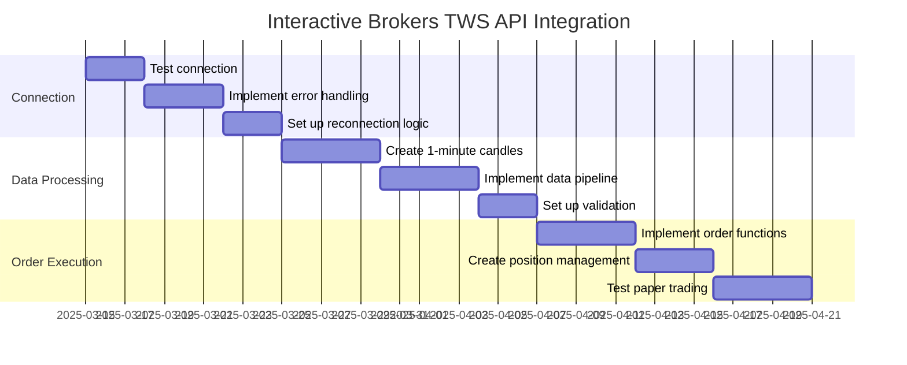
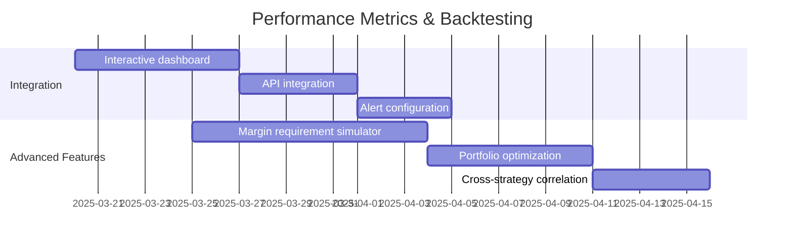
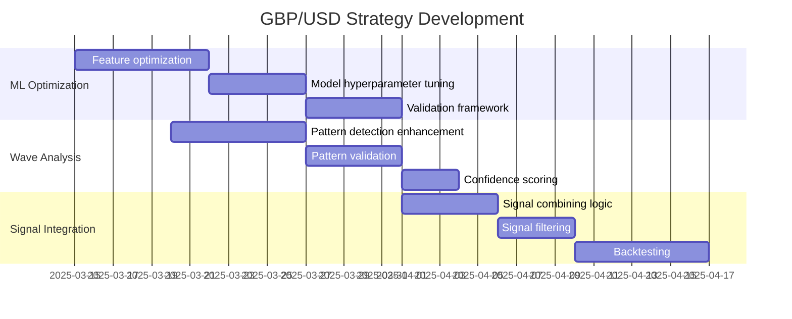

# FXML4 Project Roadmap

This document consolidates the FXML4 implementation plan, priority tasks, and next steps into a single comprehensive roadmap.

## Project Objectives

The primary goal is to create a comprehensive forex trading platform that:

1. **Combines Key Technologies:**
   - Machine learning-based signal generation (from FXML2)
   - Elliott Wave analysis (from FXML3)
   - LLM integration for strategy development and validation

2. **Market Focus:**
   - **Primary Currency Pair:** GBP/USD (initial focus)
   - **Secondary Pairs:** USD/CHF, EUR/USD, USD/JPY
   - **Analysis Timeframe:** 4-hour intervals as primary focus
   - **Data Resolution:** 1-minute data for backtesting and aggregation

3. **Performance Targets:**
   - Target Sharpe ratio of 2.5
   - Managed drawdown with dynamic position sizing
   - Production timeline of 4-12 weeks

4. **Technology Stack:**
   - Interactive Brokers TWS API for trading
   - FastAPI for backend services
   - TimescaleDB for time-series data
   - Streamlit for user interface (secondary priority)

## Current Status

The project is currently in active development with the following key achievements:

- ✅ Project structure and core organization completed
- ✅ Data engineering pipeline for market data established
- ✅ Performance metrics and backtesting system implemented
- ✅ Machine learning feature engineering completed
- ✅ Market regime classification implemented
- ✅ Economic data integration completed
- ✅ Event-driven backtesting architecture implemented

## Implementation Timeline

### Phase 1: Infrastructure and Data Engineering (Current - Week 4)

#### Priority: Interactive Brokers TWS API Integration
- [ ] **Test connection with paper trading account**
  - Use `scripts/test_ib_connection.py` to verify connectivity
  - Ensure account access and permissions are correct
  - Verify ability to retrieve market data for GBP/USD

- [ ] **Develop IB data client module**
  - Create robust connection management
  - Implement error handling and reconnection logic
  - Set up logging for IB API interactions

- [ ] **Implement real-time data processing**
  - Create 1-minute candle generation from tick data
  - Set up streaming data pipeline to TimescaleDB
  - Implement data validation and normalization

#### Priority: Data Infrastructure Finalization
- [ ] **Complete TimescaleDB setup**
  - Finalize hypertable configurations
  - Test continuous aggregates for different timeframes
  - Implement compression and retention policies

- [ ] **Create unified data preprocessing pipeline**
  - Standardize data cleaning and normalization
  - Implement multiple timeframe resampling
  - Create data quality checks and validation

- [ ] **Implement feature versioning and storage**
  - Create feature metadata tracking
  - Set up point-in-time feature retrieval
  - Implement feature version control

### Phase 2: Signal Generation & Strategy Development (Weeks 5-8)

#### Priority: GBP/USD Strategy Development
- [ ] **Integrate ML and Elliott Wave for GBP/USD**
  - Optimize features for GBP/USD
  - Enhance wave detection for GBP/USD patterns
  - Implement pattern validation with confidence scoring

- [ ] **Create combined signal framework**
  - Finalize signal combining strategy
  - Implement signal filtering based on market conditions
  - Create signal confidence scoring
  - Set up historical accuracy tracking

#### Priority: Risk Management Implementation
- [ ] **Implement position sizing**
  - Create position sizing as function of account balance
  - Implement margin requirement calculations
  - Set up dynamic leverage management
  - Create maximum position size limits

- [ ] **Develop drawdown control**
  - Create drawdown monitoring system
  - Implement position scaling based on current drawdown
  - Set up automatic risk reduction during drawdowns
  - Create alerts for approaching risk limits

#### Completed Performance Metrics Integration
- [x] Implement comprehensive performance metrics (Sharpe ratio, Sortino ratio, etc.)
- [x] Create drawdown analysis tools with recovery metrics
- [x] Set up transaction cost modeling with fee and slippage tracking
- [x] Implement Monte Carlo simulation for strategy robustness
- [x] Create market regime and factor analysis
- [x] Develop scenario analysis and parameter sensitivity tools
- [x] Implement professional report generation
- [ ] Implement margin requirement simulation

#### Completed Realistic Simulation
- [x] Enhance execution simulation with slippage
- [x] Implement event-driven backtest architecture
- [x] Create market impact modeling
- [x] Set up multi-scenario testing

### Phase 3: API and Optimization (Weeks 9-10)

#### Priority: API Development
- [ ] **Define comprehensive API schema**
  - Create OpenAPI specification
  - Define endpoints for data access, signal generation, and backtesting
  - Design authentication and authorization flow

- [ ] **Implement authentication system**
  - Set up JWT token-based authentication
  - Create API key management
  - Implement rate limiting and permissions

- [ ] **Develop data access endpoints**
  - Create endpoints for market data retrieval
  - Implement parameter validation
  - Set up efficient data querying

#### Priority: Strategy Optimization
- [ ] **Implement parameter optimization**
  - Create parameter optimization for target Sharpe ratio
  - Set up walk-forward testing framework
  - Implement automated hyperparameter optimization
  - Develop regime-specific parameter sets

- [ ] **Integrate reinforcement learning**
  - Set up RL environment with margin constraints
  - Create reward function optimizing for Sharpe ratio
  - Implement parameter optimization with RL agents
  - Set up position sizing optimization with RL

### Phase 4: External Integrations and Production (Weeks 11-14)

#### Priority: External Data Integration
- [ ] **Implement macroeconomic data**
  - Enhance FRED API client
  - Create Trading Economics connector
  - Set up data synchronization and storage
  - Implement feature generation from macroeconomic data

- [ ] **Set up sentiment analysis**
  - Implement Alpha Vantage sentiment data integration
  - Create sentiment feature extraction
  - Implement signal adjustments based on sentiment
  - Set up sentiment trend analysis

#### Priority: Monitoring and Alerts
- [ ] **Set up system monitoring**
  - Implement performance monitoring for API
  - Create database health checks
  - Set up model drift detection
  - Implement automated error reporting

- [ ] **Develop trading alerts**
  - Create signal notification system
  - Implement position monitoring alerts
  - Set up drawdown warning system
  - Develop API status notifications

#### Priority: Production Deployment
- [ ] **Finalize infrastructure setup**
  - Complete Kubernetes configuration
  - Implement auto-scaling for API services
  - Set up high-availability database
  - Create backup and recovery system

## Task Breakdown

### Interactive Brokers Integration Tasks

### Core Performance Metrics Remaining Tasks

### GBP/USD Strategy Development Tasks

## Milestones and Releases

### Milestone 1: Data Infrastructure (Week 4)
- Complete data infrastructure setup
- Finalize external API integrations (IB TWS and Alpha Vantage)
- Set up feature engineering pipeline optimized for GBP/USD

### Milestone 2: Signal Generation & Backtesting (Week 8)
- Implement ML and Elliott Wave analysis for GBP/USD
- Create combined signal generation framework
- [x] Develop comprehensive performance metrics system for backtesting
- Implement position sizing and risk management
- Create automated performance reporting system

### Milestone 3: API & Optimization (Week 10)
- Complete API development
- Implement parameter optimization for target Sharpe ratio
- Create risk management framework with margin handling

### Milestone 4: Production Readiness (Week 14)
- Set up monitoring and alerting
- Implement deployment infrastructure
- Create documentation and operational guides

## Team Assignments

1. **Developer 1**: Focus on Interactive Brokers TWS API integration
   - Complete and test the connection
   - Implement real-time data processing
   - Create order execution framework

2. **Developer 2**: Focus on data infrastructure
   - Finalize TimescaleDB setup
   - Enhance data preprocessing pipeline
   - Implement feature engineering for GBP/USD

3. **Developer 3**: Focus on API development
   - Define API schema
   - Implement authentication
   - Create core endpoints

## Dependencies and Resources

### External Dependencies
- Interactive Brokers TWS API
- Alpha Vantage API
- TimescaleDB
- Google Cloud Vertex AI (for ML deployment)

### Environment Setup
- Docker environment for development and testing
- API keys for Alpha Vantage
- IB TWS paper trading account with correct permissions

## Progress Tracking

We'll track progress using:
1. GitHub issues and milestones
2. Weekly status updates
3. Regular testing to verify functionality

The goal is to have a working prototype with GBP/USD signal generation within 4 weeks, and a production-ready system within 12 weeks.
