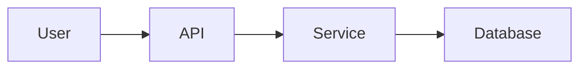

# FXML4 Redesigned Documentation

This directory contains the comprehensive documentation for the FXML4 Redesigned microservices trading system.

## Documentation Structure

```
docs/
├── index.md                    # Homepage with system overview
├── getting-started/           # Quick start guides
│   ├── overview.md           # System introduction
│   ├── installation.md       # Installation instructions
│   ├── configuration.md      # Configuration guide
│   └── first-run.md         # First run tutorial
├── architecture/             # Technical architecture
│   ├── overview.md          # Architecture principles
│   ├── microservices.md     # Service descriptions
│   ├── data-flow.md         # Data flow patterns
│   ├── message-queue.md     # RabbitMQ design
│   └── database-schema.md   # Database structure
├── services/                # Individual services
│   ├── index.md            # Services overview
│   ├── data-collector.md   # Data ingestion service
│   ├── signal-generator.md # Signal generation
│   ├── llm-analyzer.md     # AI/LLM analysis
│   ├── entry-manager.md    # Order entry logic
│   ├── trade-manager.md    # Trade management
│   └── monitor.md          # Monitoring service
├── brokers/                # Broker integrations
│   ├── overview.md         # Broker adapter pattern
│   ├── message-schemas.md  # Message format specs
│   ├── interactive-brokers.md
│   ├── manual-trading.md
│   ├── fxcm.md
│   └── oanda.md
├── api/                    # API documentation
│   ├── rest-api.md        # REST API reference
│   ├── message-schemas.md # Internal messages
│   └── webhooks.md        # Webhook endpoints
├── deployment/            # Deployment guides
│   ├── docker-compose.md  # Local deployment
│   ├── production.md      # Production setup
│   ├── monitoring.md      # Monitoring setup
│   └── troubleshooting.md # Common issues
├── development/           # Developer guides
│   ├── contributing.md    # Contribution guide
│   ├── testing.md        # Testing strategies
│   ├── debugging.md      # Debugging tips
│   └── adding-brokers.md # Adding new brokers
└── reference/            # Reference materials
    ├── configuration.md   # Config reference
    ├── environment-variables.md
    └── glossary.md       # Terms and definitions
```

## Building Documentation

### Prerequisites

```bash
pip install mkdocs mkdocs-material mkdocs-mermaid2 mkdocstrings[python]
```

### Local Development

```bash
# Serve documentation locally
mkdocs serve

# Access at http://127.0.0.1:8000
```

### Build Static Site

```bash
# Build documentation
mkdocs build

# Output in site/ directory
```

### Deploy to GitHub Pages

```bash
# Deploy to gh-pages branch
mkdocs gh-deploy
```

## Documentation Standards

### Writing Style

- Use clear, concise language
- Include code examples for all features
- Add diagrams for complex concepts
- Keep sections focused and well-organized

### Markdown Guidelines

- Use ATX-style headers (`#`)
- Include table of contents for long pages
- Use code fences with language hints
- Add alt text for all images

### Code Examples

Always include working examples:

```python
# Good example - complete and runnable
from shared.brokers import IBAdapter

adapter = IBAdapter(host="localhost", port=7497)
adapter.connect()
data = adapter.get_market_data("EURUSD")
print(f"Current price: {data.bid}/{data.ask}")
```

### Diagrams

Use Mermaid for diagrams:



## Contributing to Docs

1. Create a new branch for documentation changes
2. Follow the existing structure and style
3. Test all code examples
4. Run `mkdocs serve` to preview changes
5. Submit a pull request with clear description

## Key Documentation Files

### Most Important

1. **[index.md](index.md)** - System overview and quick links
2. **[getting-started/installation.md](getting-started/installation.md)** - Setup instructions
3. **[architecture/overview.md](architecture/overview.md)** - System design
4. **[api/rest-api.md](api/rest-api.md)** - API reference
5. **[deployment/docker-compose.md](deployment/docker-compose.md)** - Deployment guide

### For Developers

1. **[brokers/message-schemas.md](brokers/message-schemas.md)** - Message formats
2. **[services/data-collector.md](services/data-collector.md)** - Service example
3. **[development/adding-brokers.md](development/adding-brokers.md)** - Extension guide
4. **[development/testing.md](development/testing.md)** - Testing practices

### For Operations

1. **[deployment/production.md](deployment/production.md)** - Production setup
2. **[deployment/monitoring.md](deployment/monitoring.md)** - Monitoring guide
3. **[deployment/troubleshooting.md](deployment/troubleshooting.md)** - Issue resolution
4. **[reference/environment-variables.md](reference/environment-variables.md)** - Config reference

## Documentation Status

### Completed

- ✅ Homepage and overview
- ✅ Getting started guides
- ✅ Architecture documentation
- ✅ Broker message schemas
- ✅ REST API reference
- ✅ Docker Compose deployment
- ✅ Data Collector service docs

### In Progress

- 🚧 Remaining service documentation
- 🚧 Individual broker guides
- 🚧 Production deployment guide
- 🚧 Monitoring setup

### Planned

- 📅 Video tutorials
- 📅 Integration examples
- 📅 Performance tuning guide
- 📅 Security best practices

## Getting Help

- **Documentation Issues**: Open an issue on GitHub
- **Questions**: Post in discussions
- **Contributions**: See [contributing.md](development/contributing.md)
