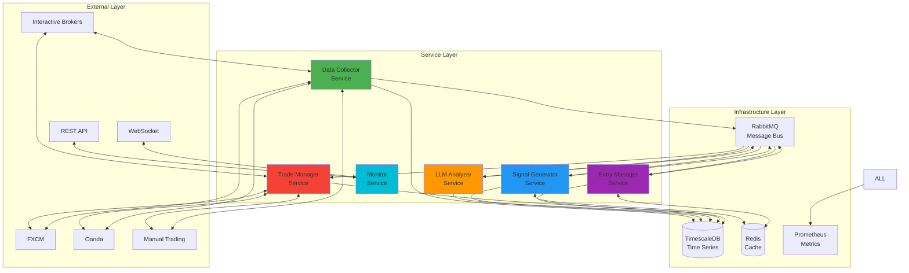
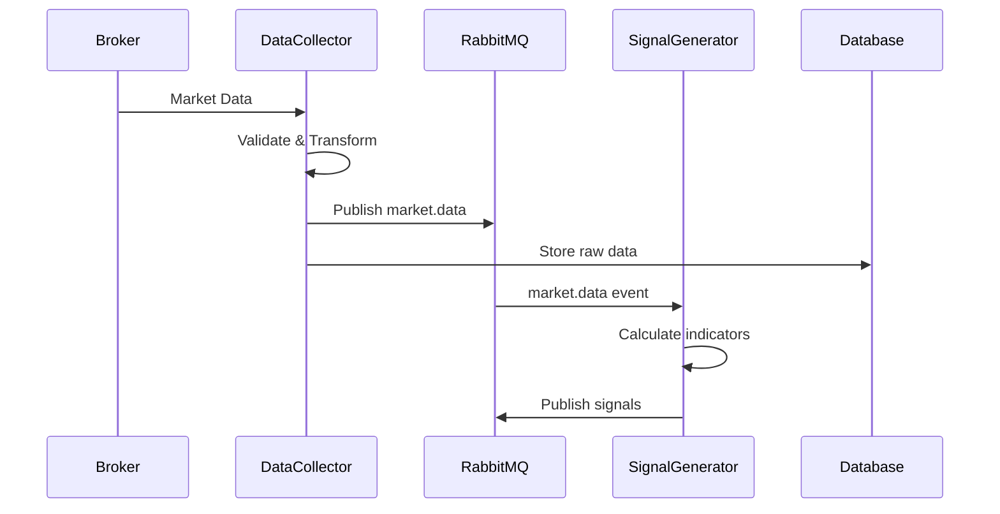
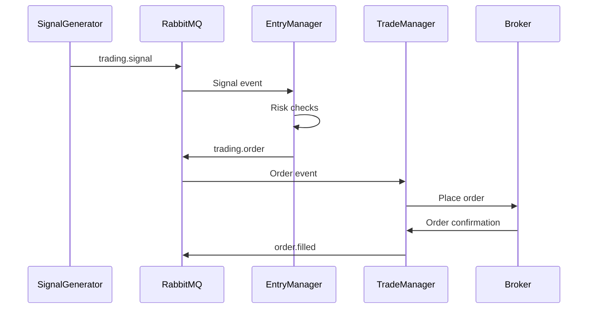
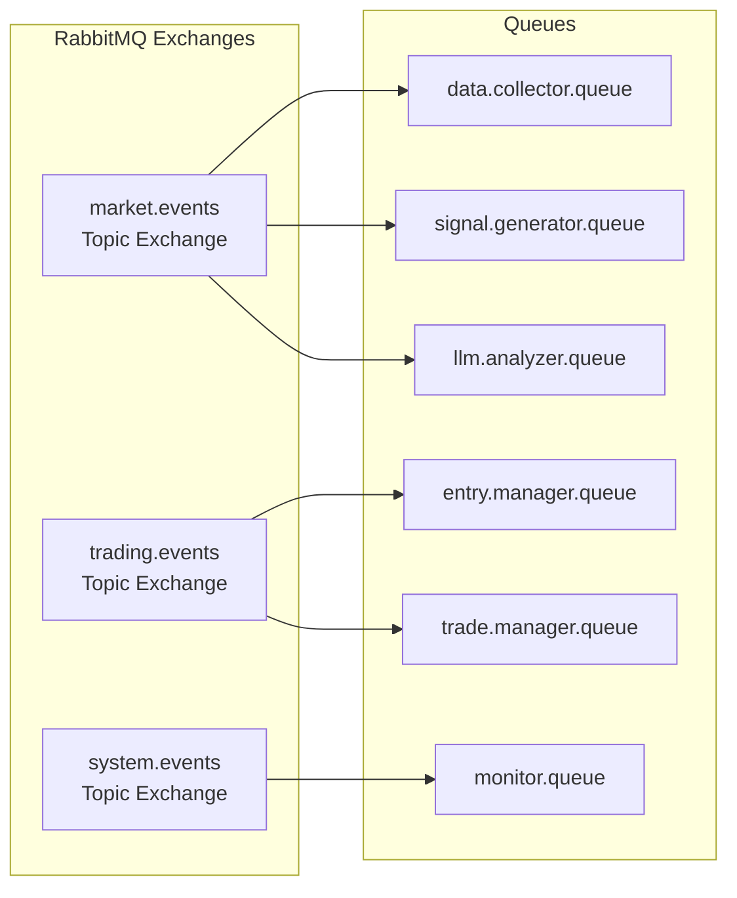
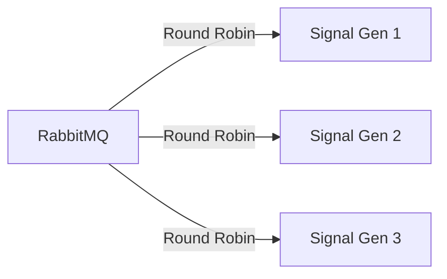

# Architecture Overview

## Design Principles

FXML4 Redesigned follows a microservices architecture with these key principles:

1. **Service Independence**: Each service can be developed, deployed, and scaled independently
2. **Message-Driven**: Services communicate via RabbitMQ message queues
3. **Event Sourcing**: All events are logged for audit and replay capabilities
4. **Fault Tolerance**: System continues operating even when individual services fail
5. **Broker Agnostic**: Support for multiple brokers through adapter pattern

## High-Level Architecture



## Core Components

### Service Layer

| Service | Responsibility | Status |
|---------|---------------|--------|
| **Data Collector** | Ingests market data from brokers | ✅ Complete |
| **Signal Generator** | Generates trading signals | 🚧 In Progress |
| **LLM Analyzer** | AI-powered market analysis | 🚧 In Progress |
| **Entry Manager** | Manages order placement | 📅 Planned |
| **Trade Manager** | Manages open positions | 📅 Planned |
| **Monitor** | System monitoring and API | ✅ Complete |

### Infrastructure Layer

| Component | Purpose | Technology |
|-----------|---------|------------|
| **Message Bus** | Service communication | RabbitMQ |
| **Time Series DB** | Market data storage | TimescaleDB |
| **Cache** | High-speed data access | Redis |
| **Metrics** | Performance monitoring | Prometheus |

### Broker Adapter Layer

The system uses a plugin architecture for broker connectivity:

```python
# Base adapter interface
class BaseBrokerAdapter:
    async def connect(self) -> None
    async def disconnect(self) -> None
    async def subscribe_market_data(self, symbols: List[str]) -> None
    async def place_order(self, order: Order) -> OrderResult
    async def get_positions(self) -> List[Position]
```

## Data Flow

### Market Data Flow



### Trade Execution Flow



## Message Queue Design

### Exchange Architecture



### Message Types

| Exchange | Routing Key | Description |
|----------|-------------|-------------|
| `market.events` | `data.{symbol}.{timeframe}` | Market data updates |
| `market.events` | `indicator.{symbol}.{name}` | Technical indicators |
| `trading.events` | `signal.{symbol}.{strategy}` | Trading signals |
| `trading.events` | `order.{action}.{symbol}` | Order events |
| `system.events` | `health.{service}` | Health checks |
| `system.events` | `error.{service}.{severity}` | Error events |

## Scalability Patterns

### Horizontal Scaling

Services can be scaled horizontally by running multiple instances:

```yaml
# docker-compose.scale.yml
services:
  signal_generator:
    deploy:
      replicas: 3

  data_collector:
    deploy:
      replicas: 2
```

### Load Distribution

RabbitMQ automatically distributes messages across service instances:



## Security Architecture

### Network Security

- Services communicate only through RabbitMQ
- No direct service-to-service communication
- TLS encryption for broker connections
- API authentication via JWT tokens

### Data Security

- Encrypted credentials in environment variables
- No sensitive data in logs
- Audit trail for all trading decisions
- Role-based access control (RBAC)

## Next Steps

- Learn about [individual microservices](microservices.md)
- Understand [data flow patterns](data-flow.md)
- Explore [message queue design](message-queue.md)
- Review [database schema](database-schema.md)
