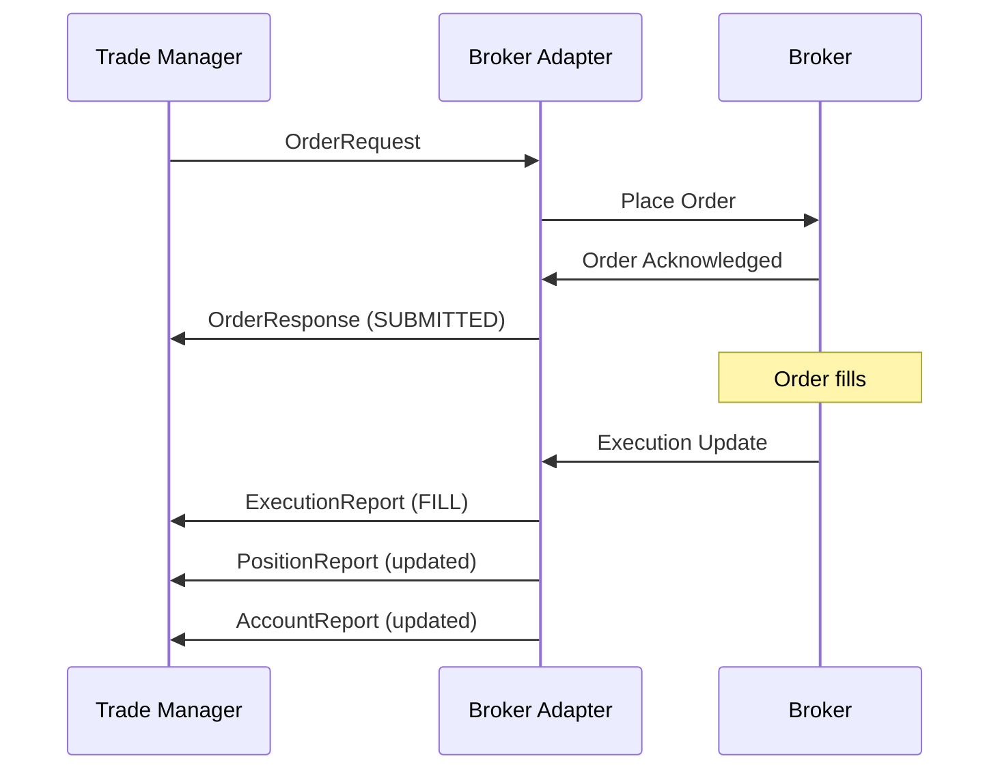
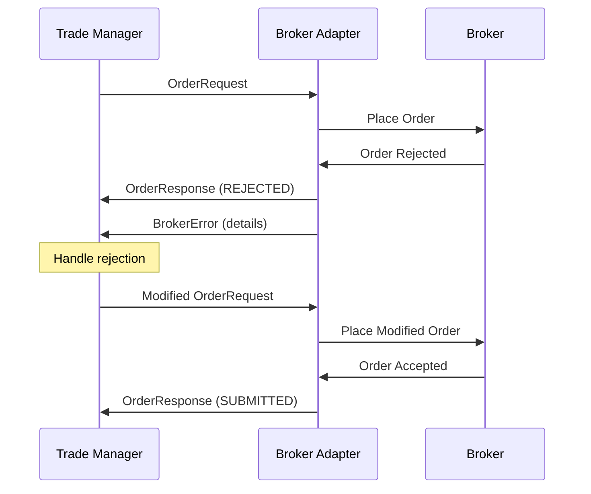

# Broker Message Schemas

## Overview

FXML4 uses standardized message schemas for all broker communications. This ensures consistency across different broker integrations and simplifies the development of new adapters.

## Core Message Types

### Base Message

All broker messages inherit from the base `BrokerMessage` class:

```python
class BrokerMessage(BaseModel):
    message_id: str  # Unique message identifier
    timestamp: datetime  # Message creation time
    broker_type: BrokerType  # IB, FXCM, OANDA, MANUAL
    account_id: str  # Trading account ID
    message_type: str  # Type of message
    correlation_id: Optional[str]  # For request/response matching
```

### Message Categories

| Category | Purpose | Key Messages |
|----------|---------|--------------|
| **Orders** | Order lifecycle management | OrderRequest, OrderResponse, ExecutionReport |
| **Positions** | Position tracking | PositionReport |
| **Account** | Account status | AccountReport |
| **Market Data** | Price feeds | MarketDataRequest, MarketDataSnapshot |
| **Status** | Connection health | BrokerStatus, BrokerError |

## Order Messages

### OrderRequest

Used to submit new orders to brokers:

```python
{
    "message_type": "ORDER_REQUEST",
    "broker_type": "IB",
    "account_id": "DU123456",
    "client_order_id": "123e4567-e89b-12d3-a456-426614174000",
    "symbol": "EURUSD",
    "order_type": "LIMIT",
    "side": "BUY",
    "quantity": 10000,
    "price": 1.0950,
    "time_in_force": "GTC",
    "take_profit_price": 1.1050,
    "stop_loss_price": 1.0850
}
```

### Order Types

| Type | Description | Required Fields |
|------|-------------|-----------------|
| `MARKET` | Immediate execution at market | quantity |
| `LIMIT` | Execute at specific price or better | quantity, price |
| `STOP` | Trigger market order at stop price | quantity, stop_price |
| `STOP_LIMIT` | Trigger limit order at stop price | quantity, price, stop_price |
| `TRAILING_STOP` | Dynamic stop based on price movement | quantity, trail_amount/trail_percent |
| `BRACKET` | Entry with stop loss and take profit | quantity, take_profit_price, stop_loss_price |

### OrderResponse

Response from broker after order submission:

```python
{
    "message_type": "ORDER_RESPONSE",
    "broker_type": "IB",
    "account_id": "DU123456",
    "client_order_id": "123e4567-e89b-12d3-a456-426614174000",
    "broker_order_id": "0000e0d5.65dc6b14.01.01",
    "status": "SUBMITTED",
    "success": true,
    "symbol": "EURUSD",
    "side": "BUY",
    "quantity": 10000,
    "filled_quantity": 0,
    "order_time": "2025-01-15T14:30:00Z"
}
```

### ExecutionReport

Real-time execution updates:

```python
{
    "message_type": "EXECUTION_REPORT",
    "broker_type": "IB",
    "account_id": "DU123456",
    "client_order_id": "123e4567-e89b-12d3-a456-426614174000",
    "broker_order_id": "0000e0d5.65dc6b14.01.01",
    "execution_id": "0000e0d5.65dc6b14.01.01.0001",
    "execution_type": "FILL",
    "order_status": "FILLED",
    "symbol": "EURUSD",
    "side": "BUY",
    "last_quantity": 10000,
    "last_price": 1.0948,
    "cumulative_quantity": 10000,
    "average_price": 1.0948,
    "commission": 2.50,
    "commission_currency": "USD"
}
```

## Position & Account Messages

### PositionReport

Current position status:

```python
{
    "message_type": "POSITION_REPORT",
    "broker_type": "OANDA",
    "account_id": "101-001-12345678-001",
    "symbol": "EURUSD",
    "position_size": 10000,  # Positive = long, Negative = short
    "average_price": 1.0948,
    "market_price": 1.0955,
    "unrealized_pnl": 70.00,
    "realized_pnl": 0,
    "currency": "USD",
    "margin_used": 1000.00
}
```

### AccountReport

Account balance and margin information:

```python
{
    "message_type": "ACCOUNT_REPORT",
    "broker_type": "FXCM",
    "account_id": "12345",
    "account_value": 100000.00,
    "cash_balance": 95000.00,
    "equity": 100070.00,
    "buying_power": 90000.00,
    "initial_margin": 5000.00,
    "maintenance_margin": 3000.00,
    "available_margin": 85000.00,
    "margin_level": 2001.40,  # Percentage
    "unrealized_pnl": 70.00,
    "realized_pnl": 1500.00,
    "base_currency": "USD"
}
```

## Market Data Messages

### MarketDataRequest

Subscribe to real-time market data:

```python
{
    "message_type": "MARKET_DATA_REQUEST",
    "broker_type": "IB",
    "account_id": "DU123456",
    "request_id": "req_123",
    "symbols": ["EURUSD", "GBPUSD", "USDJPY"],
    "data_types": ["BID", "ASK", "LAST", "VOLUME"],
    "snapshot": false  # false = streaming, true = one-time
}
```

### MarketDataSnapshot

Market data update:

```python
{
    "message_type": "MARKET_DATA_SNAPSHOT",
    "broker_type": "IB",
    "account_id": "DU123456",
    "symbol": "EURUSD",
    "bid_price": 1.0947,
    "ask_price": 1.0948,
    "bid_size": 1000000,
    "ask_size": 2000000,
    "last_price": 1.0948,
    "volume": 150000000,
    "high": 1.0975,
    "low": 1.0920,
    "market_time": "2025-01-15T14:35:00Z"
}
```

## Status & Error Messages

### BrokerStatus

Connection and capabilities status:

```python
{
    "message_type": "BROKER_STATUS",
    "broker_type": "OANDA",
    "account_id": "101-001-12345678-001",
    "status": "CONNECTED",
    "connection_quality": "EXCELLENT",
    "server_time": "2025-01-15T14:35:00Z",
    "market_open": true,
    "supported_order_types": ["MARKET", "LIMIT", "STOP", "TRAILING_STOP"],
    "supported_time_in_force": ["GTC", "IOC", "FOK"],
    "max_order_size": 10000000
}
```

### BrokerError

Error notifications:

```python
{
    "message_type": "BROKER_ERROR",
    "broker_type": "FXCM",
    "account_id": "12345",
    "error_code": "INSUFFICIENT_MARGIN",
    "error_message": "Insufficient margin for order size 100000 EURUSD",
    "error_type": "ORDER",
    "severity": "ERROR",
    "related_order_id": "123e4567-e89b-12d3-a456-426614174000",
    "recovery_suggestion": "Reduce order size or deposit additional funds"
}
```

## Manual Trading Messages

### ManualTradeNotification

For manual execution tracking:

```python
{
    "message_type": "MANUAL_TRADE_NOTIFICATION",
    "broker_type": "MANUAL",
    "account_id": "MANUAL001",
    "trade_id": "MT_20250115_001",
    "symbol": "EURUSD",
    "side": "BUY",
    "quantity": 10000,
    "price": 1.0948,
    "execution_time": "2025-01-15T14:30:00Z",
    "entry_method": "WEB",
    "trader_id": "trader1",
    "notes": "Executed via broker web platform",
    "related_signal_id": "sig_123"
}
```

## Message Flow Examples

### Order Lifecycle



### Error Handling



## Implementation Guidelines

### Message Validation

All messages are validated using Pydantic:

```python
from shared.schemas.broker_messages import OrderRequest, OrderSide, OrderType
from decimal import Decimal

# Create and validate order
try:
    order = OrderRequest(
        broker_type="IB",
        account_id="DU123456",
        client_order_id="my_order_123",
        symbol="EURUSD",
        order_type=OrderType.LIMIT,
        side=OrderSide.BUY,
        quantity=Decimal("10000"),
        price=Decimal("1.0950")
    )
except ValidationError as e:
    print(f"Invalid order: {e}")
```

### Message Serialization

Messages can be serialized to JSON:

```python
# Serialize to JSON
order_json = order.json()

# Deserialize from JSON
order_restored = OrderRequest.parse_raw(order_json)

# Convert to dict
order_dict = order.dict()
```

### Custom Message Handling

Extend base messages for broker-specific features:

```python
class IBSpecificOrder(OrderRequest):
    """Interactive Brokers specific order fields."""

    # IB-specific fields
    algo_strategy: Optional[str] = None
    algo_params: Optional[Dict[str, Any]] = None
    clearing_account: Optional[str] = None
    clearing_intent: Optional[str] = None
```

## Best Practices

1. **Always validate messages** before sending to brokers
2. **Use correlation IDs** for request/response matching
3. **Handle all error types** gracefully
4. **Log all messages** for audit trail
5. **Implement retry logic** for transient failures
6. **Monitor message latency** for performance
7. **Version your schemas** for backward compatibility

## Testing

Test message schemas using the provided factories:

```python
from shared.schemas.broker_messages import BrokerMessageFactory

# Create test market order
order = BrokerMessageFactory.create_market_order(
    broker_type="IB",
    account_id="TEST123",
    symbol="EURUSD",
    side="BUY",
    quantity=Decimal("10000")
)

# Create test bracket order
bracket = BrokerMessageFactory.create_bracket_order(
    broker_type="OANDA",
    account_id="TEST456",
    symbol="GBPUSD",
    side="SELL",
    quantity=Decimal("5000"),
    take_profit_price=Decimal("1.2700"),
    stop_loss_price=Decimal("1.2800")
)
```
