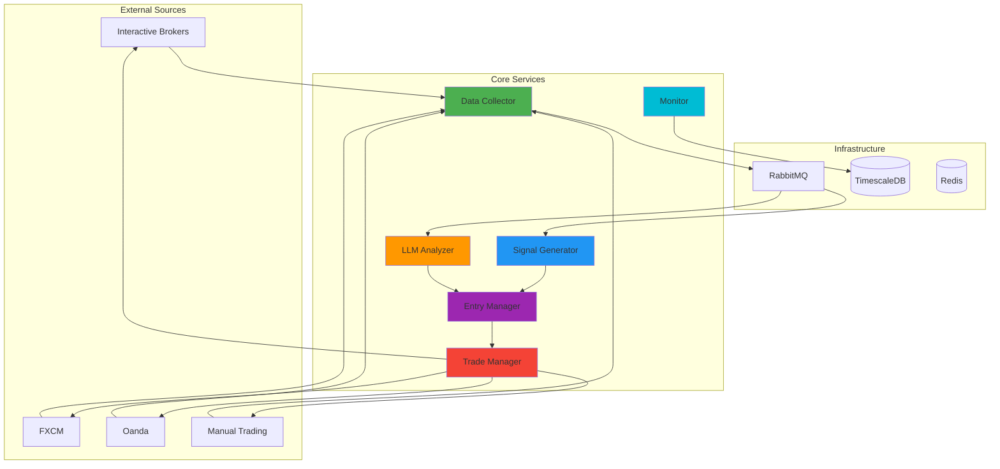

# FXML4 Redesigned Documentation

  
  <h3>Modern Microservices Trading System</h3>
  
Scalable, intelligent, and broker-agnostic forex trading platform

## Welcome to FXML4 Redesigned

FXML4 Redesigned is a complete rewrite of the original FXML4 trading system, built from the ground up with a modern microservices architecture. This documentation covers the system architecture, services, deployment, and development guides.

## System Status

!!! info "Current Phase"
    - **Phase 1: Infrastructure** ✅ Complete
    - **Phase 2: Intelligence Layer** 🚧 In Progress
    - **Phase 3: Advanced Features** 📅 Planned

## Key Features

- :material-scale-balance: **Microservices Architecture**
  Scalable, fault-tolerant design with independent services

- :material-message-fast: **RabbitMQ Messaging**
  Asynchronous communication between services

- :material-database: **TimescaleDB Storage**
  Optimized time-series data handling

- :material-swap-horizontal: **Multi-Broker Support**
  Connect to multiple brokers simultaneously

- :material-brain: **AI/ML Integration**
  LLM-powered analysis and advanced signals

- :material-monitor-dashboard: **Real-time Monitoring**
  Comprehensive system and trade monitoring

## Quick Links

- [🚀 Getting Started](getting-started/overview.md) - Get up and running quickly
- [🏗️ Architecture](architecture/overview.md) - Understand the system design
- [📡 API Reference](api/rest-api.md) - Integrate with FXML4
- [🔧 Development](development/contributing.md) - Contribute to the project

## Architecture Overview

## System Components

### Phase 1: Infrastructure (Complete) ✅

- **Message Queue**: RabbitMQ-based event streaming
- **Database**: TimescaleDB for time-series data
- **Broker Adapters**: Multi-broker connectivity layer
- **Base Services**: Common service framework
- **Docker Infrastructure**: Containerized deployment

### Phase 2: Intelligence Layer (In Progress) 🚧

- **Signal Generator**: Technical analysis and pattern recognition
- **LLM Analyzer**: AI-powered market analysis
- **Entry Manager**: Smart order placement logic
- **Trade Manager**: Position and risk management

### Phase 3: Advanced Features (Planned) 📅

- Web dashboard and API
- Advanced risk management
- Portfolio optimization
- Backtesting engine
- Performance analytics

## Getting Help

- 📖 Browse the [documentation](getting-started/overview.md)
- 🐛 Report [issues on GitHub](https://github.com/fxml4/fxml4-redesigned/issues)
- 💬 Join our [Discord community](https://discord.gg/fxml4)
- 📧 Contact the team at [support@fxml4.io](mailto:support@fxml4.io)

## License

FXML4 Redesigned is licensed under the MIT License. See the [LICENSE](https://github.com/fxml4/fxml4-redesigned/LICENSE) file for details.
