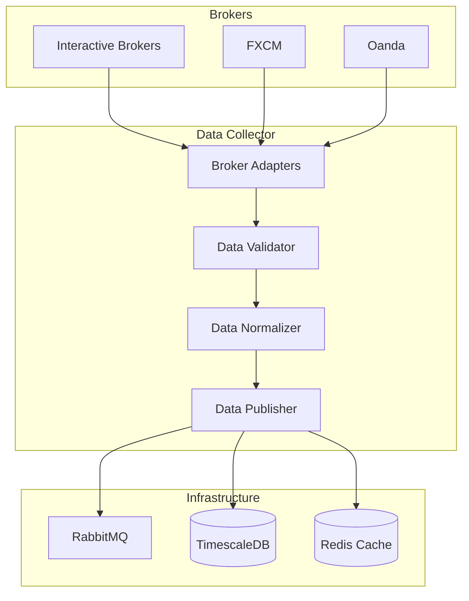
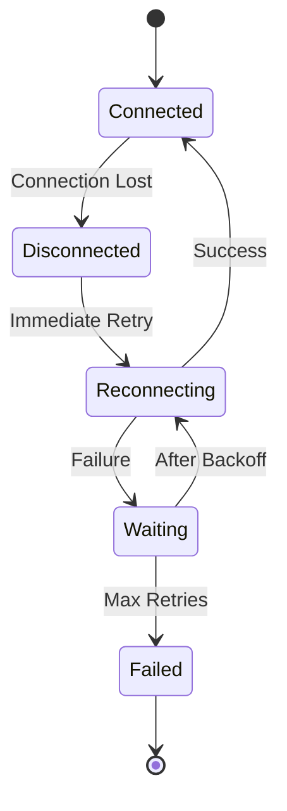

# Data Collector Service

## Overview

The Data Collector service is responsible for ingesting market data from multiple brokers and distributing it to other services via RabbitMQ. It handles real-time price feeds, historical data requests, and ensures data quality and consistency.

## Architecture



## Key Features

- **Multi-broker support**: Connect to multiple data sources simultaneously
- **Data normalization**: Standardize data formats across brokers
- **Real-time streaming**: Low-latency market data distribution
- **Data validation**: Ensure data quality and consistency
- **Fault tolerance**: Handle broker disconnections gracefully
- **Historical data**: Fetch and store historical price data

## Configuration

### Environment Variables

```bash
# Service configuration
DC_SERVICE_NAME=data_collector
DC_LOG_LEVEL=INFO
DC_HEALTH_CHECK_INTERVAL=30

# RabbitMQ settings
RABBITMQ_HOST=localhost
RABBITMQ_PORT=5672
RABBITMQ_USER=guest
RABBITMQ_PASS=guest

# TimescaleDB settings
TIMESCALE_HOST=localhost
TIMESCALE_PORT=5432
TIMESCALE_DB=fxml4
TIMESCALE_USER=postgres
TIMESCALE_PASS=postgres

# Redis settings
REDIS_HOST=localhost
REDIS_PORT=6379
REDIS_DB=0

# Broker configurations
IB_ENABLED=true
IB_HOST=127.0.0.1
IB_PORT=7497
IB_CLIENT_ID=1

OANDA_ENABLED=true
OANDA_API_KEY=your_api_key
OANDA_ACCOUNT_ID=your_account_id
OANDA_ENVIRONMENT=practice

FXCM_ENABLED=false
FXCM_USERNAME=your_username
FXCM_PASSWORD=your_password
FXCM_CONNECTION=Demo
```

### Symbol Configuration

```yaml
# config/symbols.yaml
symbols:
  forex:
    - symbol: EURUSD
      brokers: [IB, OANDA, FXCM]
      timeframes: [1m, 5m, 15m, 1h, 4h, 1d]
      priority: HIGH

    - symbol: GBPUSD
      brokers: [IB, OANDA]
      timeframes: [5m, 15m, 1h, 4h]
      priority: HIGH

    - symbol: USDJPY
      brokers: [OANDA, FXCM]
      timeframes: [15m, 1h, 4h]
      priority: MEDIUM

  data_quality:
    max_spread_pips: 5
    max_price_age_seconds: 10
    outlier_threshold: 3  # Standard deviations
```

## Data Flow

### Real-time Market Data

1. **Broker Connection**: Establish connections to configured brokers
2. **Data Subscription**: Subscribe to symbols based on configuration
3. **Data Reception**: Receive raw market data from brokers
4. **Validation**: Check data quality and timestamps
5. **Normalization**: Convert to standard format
6. **Distribution**: Publish to RabbitMQ and store in TimescaleDB

### Message Publishing

The service publishes market data to RabbitMQ:

```python
# Published to exchange: market.events
# Routing key format: data.{symbol}.{timeframe}

{
    "timestamp": "2025-01-15T14:30:00Z",
    "symbol": "EURUSD",
    "timeframe": "1m",
    "open": 1.0945,
    "high": 1.0948,
    "low": 1.0943,
    "close": 1.0947,
    "volume": 125000,
    "bid": 1.0947,
    "ask": 1.0948,
    "spread": 1,
    "broker": "IB"
}
```

## Data Quality

### Validation Rules

| Check | Description | Action on Failure |
|-------|-------------|-------------------|
| **Timestamp** | Within acceptable range | Reject data |
| **Price Range** | Within daily high/low ±X% | Flag as suspicious |
| **Spread** | Below maximum threshold | Use backup broker |
| **Sequence** | No missing ticks | Request resend |
| **Duplicates** | No duplicate timestamps | Deduplicate |

### Data Aggregation

Multiple broker prices are aggregated using:

```python
# Weighted average based on broker reliability
aggregated_price = Σ(price_i * weight_i) / Σ(weight_i)

# Broker weights
weights = {
    "IB": 0.4,
    "OANDA": 0.35,
    "FXCM": 0.25
}
```

## API Endpoints

The Data Collector exposes internal API endpoints:

### Health Check

```http
GET /health
```

Response:
```json
{
    "status": "healthy",
    "timestamp": "2025-01-15T14:30:00Z",
    "brokers": {
        "IB": "connected",
        "OANDA": "connected",
        "FXCM": "disconnected"
    },
    "data_flow": {
        "messages_per_second": 150,
        "last_update": "2025-01-15T14:29:59Z"
    }
}
```

### Symbol Status

```http
GET /symbols/{symbol}/status
```

Response:
```json
{
    "symbol": "EURUSD",
    "status": "active",
    "brokers": ["IB", "OANDA"],
    "last_price": {
        "bid": 1.0947,
        "ask": 1.0948,
        "timestamp": "2025-01-15T14:29:59Z"
    },
    "quality_metrics": {
        "spread": 1,
        "update_frequency": 0.5,
        "data_gaps": 0
    }
}
```

## Monitoring

### Key Metrics

| Metric | Description | Alert Threshold |
|--------|-------------|-----------------|
| `dc_messages_received_total` | Total messages from brokers | - |
| `dc_messages_published_total` | Messages published to RabbitMQ | - |
| `dc_broker_connection_status` | Broker connection health | 0 = disconnected |
| `dc_data_latency_seconds` | End-to-end data latency | > 1 second |
| `dc_validation_errors_total` | Data validation failures | > 100/minute |

### Prometheus Queries

```promql
# Data flow rate
rate(dc_messages_published_total[5m])

# Broker availability
avg_over_time(dc_broker_connection_status[5m])

# Data quality
rate(dc_validation_errors_total[5m]) / rate(dc_messages_received_total[5m])
```

## Error Handling

### Broker Disconnection



### Failover Strategy

1. **Primary broker fails**: Switch to secondary broker
2. **All brokers fail**: Use cached data with warnings
3. **Extended outage**: Halt trading and alert operators

## Development

### Running Locally

```bash
# Start dependencies
docker-compose up -d rabbitmq timescaledb redis

# Install Python dependencies
pip install -r requirements.txt

# Run the service
python -m services.data_collector.main
```

### Testing

```bash
# Unit tests
pytest tests/unit/test_data_collector.py

# Integration tests
pytest tests/integration/test_data_collector_integration.py

# Load testing
python tests/load/test_data_collector_load.py
```

### Adding a New Broker

1. Create adapter in `shared/brokers/`:
```python
from shared.brokers.base_broker_adapter import BaseBrokerAdapter

class NewBrokerAdapter(BaseBrokerAdapter):
    async def connect(self):
        # Implementation
        pass

    async def subscribe_market_data(self, symbols):
        # Implementation
        pass
```

2. Register in `services/data_collector/broker_manager.py`:
```python
BROKER_ADAPTERS = {
    "NEW_BROKER": NewBrokerAdapter,
    # ... existing brokers
}
```

3. Add configuration:
```bash
NEW_BROKER_ENABLED=true
NEW_BROKER_API_KEY=your_key
```

## Performance Tuning

### Optimization Tips

1. **Batch Processing**: Process multiple ticks together
2. **Connection Pooling**: Reuse broker connections
3. **Async I/O**: Use asyncio for concurrent operations
4. **Memory Management**: Clear old data from cache
5. **Message Compression**: Compress large messages

### Benchmarks

| Metric | Target | Current |
|--------|--------|---------|
| Tick-to-publish latency | < 10ms | 8ms |
| Messages per second | > 1000 | 1500 |
| Memory usage | < 1GB | 750MB |
| CPU usage | < 50% | 35% |

## Troubleshooting

### Common Issues

1. **High latency**
   - Check network connectivity
   - Verify broker API limits
   - Review message queue performance

2. **Missing data**
   - Check broker subscriptions
   - Verify symbol configuration
   - Review validation logs

3. **Memory growth**
   - Check cache expiration
   - Review message retention
   - Monitor connection leaks

### Debug Mode

Enable detailed logging:
```bash
DC_LOG_LEVEL=DEBUG
DC_LOG_FORMAT=json
DC_TRACE_MESSAGES=true
```

## Next Steps

- Configure [Signal Generator](signal-generator.md) to consume data
- Set up [monitoring dashboards](../deployment/monitoring.md)
- Review [broker-specific documentation](../brokers/overview.md)
