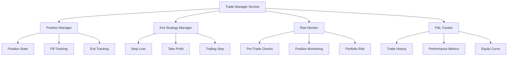
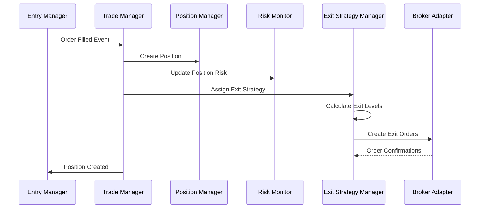
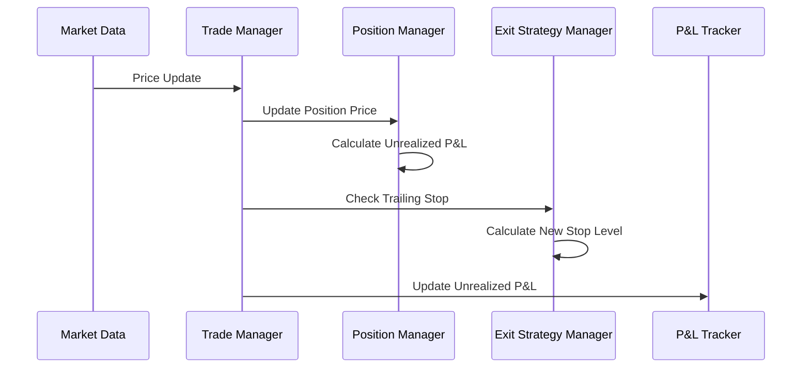

# Trade Manager Service

The Trade Manager Service is responsible for managing the complete lifecycle of trading positions, from entry to exit, including risk management and P&L tracking.

## Overview

The Trade Manager Service handles:

- Position lifecycle management
- Stop loss and take profit management
- Trailing stop implementation
- Partial position exits
- Risk monitoring and enforcement
- P&L tracking and performance metrics
- Integration with multiple brokers

## Architecture

The service consists of four main components:



## Components

### Position Manager

Manages position lifecycle and state transitions:

```python
from services.trade_manager.position_manager import PositionManager

# Create position manager
manager = PositionManager()

# Create a new position
position = await manager.create_position({
    'position_id': 'pos_123',
    'symbol': 'EURUSD',
    'side': 'BUY',
    'target_quantity': '10000',
    'stop_loss': '1.0920',
    'take_profit_1': '1.0980'
})

# Update with fill
await manager.update_position_fill(
    'pos_123',
    quantity=Decimal('10000'),
    price=Decimal('1.0950'),
    commission=Decimal('10')
)

# Track position metrics
metrics = await manager.get_position_metrics('pos_123')
```

**Position States:**
- `PENDING` - Position created but not yet opened
- `OPENING` - Orders placed, waiting for fills
- `OPEN` - Position fully or partially filled
- `SCALING_OUT` - Partial exits in progress
- `CLOSING` - Full exit in progress
- `CLOSED` - Position fully closed
- `ERROR` - Error state

### Exit Strategy Manager

Handles all exit logic including stops, targets, and trailing stops:

```python
from services.trade_manager.exit_strategy_manager import ExitStrategyManager

# Create exit manager
exit_manager = ExitStrategyManager()

# Assign strategy to position
strategy = await exit_manager.assign_strategy(
    'pos_123',
    'conservative'  # or 'aggressive', 'scalping', custom
)

# Calculate exit levels
levels = await exit_manager.calculate_exit_levels(
    position_data,
    market_data  # Optional: includes ATR for dynamic stops
)

# Create exit orders
order_ids = await exit_manager.create_exit_orders(
    position_data,
    levels,
    broker_adapter
)
```

**Built-in Strategies:**

1. **Conservative**
   - Fixed 30 pip stop loss
   - Take profits at 50/100/150 pips
   - Trailing stop after 50 pips
   - Move to breakeven at TP1

2. **Aggressive**
   - ATR-based stop (1.5x ATR)
   - Take profits at 100/200/300 pips
   - Trailing stop after 100 pips
   - Wider risk tolerance

3. **Scalping**
   - Tight 10 pip stop
   - Single take profit at 15 pips
   - Time-based exit after 1 hour
   - No trailing stop

### Risk Monitor

Real-time risk monitoring and enforcement:

```python
from services.trade_manager.risk_monitor import RiskMonitor

# Create risk monitor
monitor = RiskMonitor()
await monitor.initialize(config)

# Pre-trade risk check
allowed, violations = await monitor.check_pre_trade_risk(
    trade_request,
    account_data,
    existing_positions
)

if not allowed:
    print(f"Trade rejected: {violations}")

# Portfolio risk monitoring
metrics = await monitor.check_portfolio_risk(
    positions,
    account_data
)

# Create risk alert
if metrics['total_exposure'] > 0.25:
    alert = await monitor.create_alert(
        RiskType.EXPOSURE,
        RiskLevel.HIGH,
        "Total exposure exceeds 25%",
        action_required=True
    )
```

**Risk Limits:**
- Maximum position size
- Maximum positions (total and per symbol)
- Daily/weekly/monthly loss limits
- Maximum drawdown
- Exposure limits (total and correlated)
- Volatility-based adjustments

### P&L Tracker

Comprehensive P&L tracking and performance analytics:

```python
from services.trade_manager.pnl_tracker import PnLTracker

# Create P&L tracker
tracker = PnLTracker()
await tracker.initialize(starting_balance=Decimal('100000'))

# Record trade lifecycle
await tracker.record_trade_open({
    'position_id': 'pos_123',
    'symbol': 'EURUSD',
    'side': 'BUY',
    'quantity': '10000',
    'entry_price': '1.0950'
})

# Update unrealized P&L
await tracker.update_position_pnl(
    'pos_123',
    current_price=Decimal('1.0970')
)

# Record trade close
await tracker.record_trade_close(
    'pos_123',
    exit_price=Decimal('1.0980'),
    commission=Decimal('10')
)

# Get performance summary
summary = await tracker.get_performance_summary()
```

**Performance Metrics:**
- Win rate and profit factor
- Average win/loss
- Maximum consecutive wins/losses
- Sharpe and Sortino ratios
- Maximum drawdown and duration
- P&L by symbol and strategy
- Time-based analysis

## Message Flow

### Position Opening



### Position Management



## Configuration

### Service Configuration

```yaml
trade_manager:
  max_positions: 10
  max_positions_per_symbol: 3
  position_check_interval: 5  # seconds

  risk_limits:
    max_position_size: 100000
    daily_loss_limit: 0.02  # 2%
    max_drawdown: 0.15  # 15%
    max_exposure: 0.30  # 30%

  exit_strategies:
    default: "conservative"
    trailing_stop_enabled: true
    weekend_exit_enabled: true

  pnl_tracking:
    track_by_symbol: true
    track_by_strategy: true
    calculate_sharpe: true
    equity_curve_interval: 60  # seconds
```

### Database Schema

```sql
-- Positions table
CREATE TABLE positions (
    position_id VARCHAR(50) PRIMARY KEY,
    signal_id VARCHAR(50),
    symbol VARCHAR(20) NOT NULL,
    side VARCHAR(10) NOT NULL,
    state VARCHAR(20) NOT NULL,

    -- Quantities
    target_quantity DECIMAL(20,8),
    filled_quantity DECIMAL(20,8),
    remaining_quantity DECIMAL(20,8),

    -- Prices
    target_entry DECIMAL(20,8),
    avg_entry_price DECIMAL(20,8),
    current_price DECIMAL(20,8),

    -- Exit levels
    stop_loss DECIMAL(20,8),
    take_profit_1 DECIMAL(20,8),
    take_profit_2 DECIMAL(20,8),
    take_profit_3 DECIMAL(20,8),

    -- P&L
    realized_pnl DECIMAL(20,8),
    unrealized_pnl DECIMAL(20,8),
    commission DECIMAL(20,8),

    -- Timestamps
    created_at TIMESTAMP,
    opened_at TIMESTAMP,
    closed_at TIMESTAMP,
    last_updated TIMESTAMP,

    -- Metadata
    broker VARCHAR(50),
    strategy VARCHAR(50),
    metadata JSONB
);

-- Exit orders table
CREATE TABLE exit_orders (
    order_id VARCHAR(50) PRIMARY KEY,
    position_id VARCHAR(50) REFERENCES positions(position_id),
    exit_type VARCHAR(20),  -- stop_loss, take_profit_1, etc.
    order_side VARCHAR(10),
    quantity DECIMAL(20,8),
    price DECIMAL(20,8),
    status VARCHAR(20),
    created_at TIMESTAMP,
    filled_at TIMESTAMP
);

-- Risk alerts table
CREATE TABLE risk_alerts (
    alert_id VARCHAR(50) PRIMARY KEY,
    risk_type VARCHAR(30),
    risk_level VARCHAR(20),
    message TEXT,
    details JSONB,
    position_ids TEXT[],
    created_at TIMESTAMP,
    resolved_at TIMESTAMP,
    auto_resolved BOOLEAN
);

-- Trade history table
CREATE TABLE trade_history (
    trade_id SERIAL PRIMARY KEY,
    position_id VARCHAR(50),
    symbol VARCHAR(20),
    side VARCHAR(10),
    quantity DECIMAL(20,8),
    entry_price DECIMAL(20,8),
    exit_price DECIMAL(20,8),
    entry_time TIMESTAMP,
    exit_time TIMESTAMP,
    gross_pnl DECIMAL(20,8),
    commission DECIMAL(20,8),
    net_pnl DECIMAL(20,8),
    strategy VARCHAR(50),
    outcome VARCHAR(20),  -- win, loss, breakeven
    metadata JSONB
);
```

## API Endpoints

The Trade Manager exposes internal APIs for other services:

### Position Management

- `GET /positions` - List all positions
- `GET /positions/{position_id}` - Get position details
- `POST /positions` - Create new position
- `PUT /positions/{position_id}` - Update position
- `DELETE /positions/{position_id}` - Close position

### Risk Management

- `GET /risk/summary` - Get risk summary
- `POST /risk/check` - Pre-trade risk check
- `GET /risk/alerts` - List active alerts
- `PUT /risk/alerts/{alert_id}/resolve` - Resolve alert

### Performance

- `GET /performance/summary` - Performance summary
- `GET /performance/equity-curve` - Equity curve data
- `GET /performance/trades` - Trade history
- `GET /performance/metrics/{period}` - Period metrics

## Best Practices

### Position Management

1. **Always use position IDs** - Never rely on symbol alone
2. **Track all fills** - Including partials and commissions
3. **Update prices frequently** - At least every minute
4. **Handle disconnections** - Positions must survive restarts

### Risk Management

1. **Pre-trade checks are mandatory** - Never skip risk checks
2. **Monitor continuously** - Not just at entry
3. **Act on alerts immediately** - Especially critical ones
4. **Track correlation** - Especially for correlated pairs

### Exit Management

1. **Place exits immediately** - Right after position entry
2. **Use OCO orders** - When broker supports it
3. **Monitor broker confirmations** - Don't assume success
4. **Handle partial fills** - Adjust exit sizes accordingly

### P&L Tracking

1. **Include all costs** - Commissions, swaps, spreads
2. **Track unrealized P&L** - For risk management
3. **Separate strategies** - For performance analysis
4. **Regular snapshots** - For recovery and analysis

## Monitoring

Key metrics to monitor:

- Open positions count and value
- Daily P&L and drawdown
- Risk alerts (especially critical)
- Order rejection rates
- Exit fill rates
- System latency

## Troubleshooting

### Common Issues

1. **Position stuck in OPENING state**
   - Check broker connection
   - Verify order status with broker
   - Check for rejected orders

2. **Exit orders not placed**
   - Verify broker adapter is connected
   - Check exit strategy configuration
   - Look for risk limit violations

3. **P&L calculations incorrect**
   - Verify commission tracking
   - Check for missed fills
   - Ensure price updates are current

4. **Risk alerts not clearing**
   - May need manual resolution
   - Check if conditions still exist
   - Verify alert resolution logic

## Integration Examples

### With Entry Manager

```python
# Entry Manager sends filled order
await publish_message(
    Exchanges.ORDERS,
    RoutingKeys.ORDER_FILLED,
    {
        'order_id': 'ord_123',
        'signal_id': 'sig_456',
        'symbol': 'EURUSD',
        'side': 'BUY',
        'filled_quantity': 10000,
        'avg_price': 1.0950
    }
)
```

### With Monitor Service

```python
# Subscribe to position updates
await consume_messages(
    Queues.POSITION_UPDATES,
    handle_position_update
)

async def handle_position_update(message):
    # Update dashboard
    # Send alerts
    # Log metrics
    pass
```
